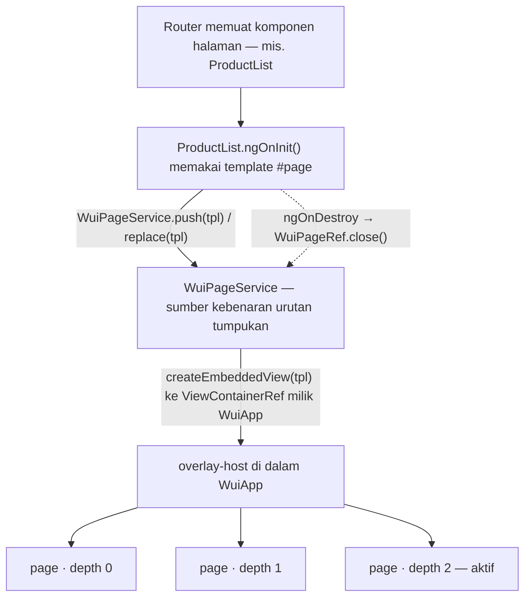

# Planning — `WuiApp` + `PageService` / `PageRef` (App Shell & Page Stack)

> Tujuan: `WuiApp` jadi **root component** di setiap aplikasi yang dibangun dengan `@wajek/wui`, dan
> bertugas menyediakan **overlay host** untuk menumpuk page. Komponen yang berperilaku seperti halaman
> memunculkan dirinya lewat `PageService.push()` / `replace()`, lalu menutupnya lewat `PageRef.pop()`.

Status: **Draft untuk direview** — belum ada implementasi. Planning SCSS sebelumnya:
`docs/planning/scss-wui-plan.md`.

---

## 0. Yang sudah dikunci dari arahan Anda

| # | Keputusan | Nilai |
| --- | --- | --- |
| P1 | Peran `WuiApp` | Root component, dipakai **sekali** di setiap aplikasi |
| P2 | Isi `WuiApp` | **Hanya** menyediakan overlay host (`ViewContainerRef`) tempat page ditumpuk |
| P3 | Behavior page | Overlay, **bertumpuk** (layer, bukan dialog tunggal) |
| P4 | Gaya penulisan | Standalone component |
| P5 | Bentuk page | Berupa **`<ng-template>`** di template komponen — **tidak** dirender langsung oleh komponen |
| P6 | Kapan dibuka | Saat `ngOnInit`, komponen memanggil `WuiPageService.push()` / `replace()` memakai template itu |
| P7 | Kapan ditutup | Saat `ngOnDestroy`, komponen memanggil `WuiPageRef.close()` |
| P8 | Tumpuk vs replace | **Diserahkan ke komponen** — service hanya mengeksekusi |
| P9 | Peran router | Router **hanya memuat komponen**. Urusan tumpukan bukan urusan router |
| P10 | Nama ekspor | `WuiPageService`, `WuiPageRef`, `WuiPageOptions` |
| P11 | Tombol back browser | **Tanpa** integrasi `popstate` — tertangani otomatis karena route berubah → komponen di-destroy → `close()` |

Catatan kondisi saat ini (hasil audit):

| Item | Temuan |
| --- | --- |
| `projects/wui/src/app/app.ts` | Sudah bernama class `WuiApp`, selector `wui-app`, standalone |
| `projects/wui/src/app/app.html` | Masih placeholder `<p>app works!</p>` — **belum** ada `<ng-content/>` dan overlay host |
| `projects/wui/src/public-api.ts` | Sudah mengekspor `./app/app` (dan masih `./lib/wui` — kandidat dibuang) |
| Root app `src/app/app.html` | Sudah membungkus konten dengan `<wui-app> … </wui-app>` |
| `projects/wui/src/lib/wui.ts` | Scaffold lama (`lib-wui`), tidak dipakai — kandidat dihapus |
| Style layer | Baru placeholder `--wui-loaded` → token `--wui-z-*`, motion, backdrop **belum ada** |

---

## 1. Model mental

`WuiApp` = **wadah**. `WuiPageService` = **pengelola tumpukan**. Komponen halaman = **yang menentukan**.



Prinsip yang dipakai:

1. **Satu WuiApp per aplikasi.** Instance kedua = konfigurasi salah → error jelas, bukan diam-diam.
2. **Urutan tumpukan dipegang `WuiPageService`**, bukan urutan DOM atau `z-index` manual di tiap komponen.
3. **Overlay host tidak memblokir aplikasi.** Host `position: fixed` + `pointer-events: none`; yang boleh
   menerima event hanya layer page.
4. **Komponen yang menentukan.** Service tidak pernah memutuskan sendiri kapan page dibuka/ditutup — ia
   hanya mengeksekusi perintah dan menjaga konsistensi tumpukan.
5. **`WuiApp` sengaja bodoh.** Tugasnya cuma menyediakan elemen overlay dan menyerahkan
   `ViewContainerRef`-nya ke service.

---

## 2. Keputusan yang perlu dikunci SEBELUM coding

### K1 — Bagaimana page masuk ke overlay host? ✅ **SUDAH DIPUTUSKAN**

**Pilihan: service-driven dengan `<ng-template>`.** Komponen yang berperan sebagai halaman **tidak**
merender kontennya sendiri — kontennya ditaruh di dalam `<ng-template #page>` pada template komponen
tersebut. Saat `ngOnInit`, komponen memanggil `WuiPageService.push(templateRef)` atau `replace(templateRef)`,
lalu service me-render template itu ke `ViewContainerRef` milik overlay host di `WuiApp`.

Kenapa ini yang dipilih:

- **Komponen yang menentukan**: kapan dibuka, sebagai tumpukan baru (`push`) atau menimpa (`replace`).
- Urutan DOM = urutan tumpukan, jadi bebas dari masalah `transform`/stacking context seperti pada
  pendekatan `position: fixed`.
- Konten page tetap ditulis di template komponen, jadi binding, `inject()`, dan state komponen langsung
  terpakai — tanpa perlu memecahnya jadi komponen terpisah atau passing input satu-satu.
- Tidak butuh `@angular/cdk/portal` maupun `createComponent()` — `ViewContainerRef.createEmbeddedView()`
  sudah cukup.

Opsi yang ditolak (jejak keputusan): `position: fixed` di komponen page (rapuh terhadap ancestor
ber-`transform`), `@angular/cdk/portal` (dependency tambahan tanpa manfaat berarti), dan
`createComponent()` + `setInput()` (memaksa konten page jadi komponen terpisah).

> ⚠️ **Detail teknis penting:** `TemplateRef` dari `<ng-template>` baru tersedia **setelah** view dibuat,
jadi `ngOnInit` hanya bisa memakainya kalau query-nya `static`:
> `@ViewChild('page', { static: true }) page!: TemplateRef<unknown>;`
> Signal query (`viewChild()`) **tidak bisa** dipakai di `ngOnInit`.

### K2 — Status halaman terhadap Angular Router

| Opsi | Keterangan |
| --- | --- |
| **Router tetap dipakai, stack ortogonal** (rekomendasi) | `<router-outlet>` jadi konten di dalam `WuiApp`. Page stack murni lapisan UI di atasnya. Route tidak berubah saat push/pop page |
| Router diintegrasikan | Setiap push/pop mengubah URL (bisa deep-link, tapi kompleks & rawan konflik) |
| Router ditinggalkan | Navigasi sepenuhnya lewat stack (gaya aplikasi mobile). Perubahan besar di aplikasi konsumen |

### K3 — Varian halaman

Minimal dua perilaku yang biasanya berbeda. Perlu diputuskan sekarang karena memengaruhi API:

| Varian | Backdrop | Dismiss | Contoh |
| --- | --- | --- | --- |
| `full` | Opaque, menutup penuh | ESC / tombol close | Halaman detail produk |
| `modal` | Transparan + blur/dim | ESC / klik backdrop | Form singkat, konfirmasi |
| `sheet` *(opsional)* | Transparan | Drag-down | Aksi cepat dari bawah |

Rekomendasi: mulai dengan `full` + `modal`, sisakan `sheet` untuk fase lanjutan.

### K4 — Kedalaman tumpukan

- Tak terbatas (stak bertambah terus) vs dibatasi (mis. maks 3).
- Apakah halaman di bawahnya ikut mengecil/bergeser (efek tumpukan kartu) atau tetap?

Rekomendasi: kedalaman bebas, halaman di bawah `scale(0.96)` + dim, bisa dimatikan lewat token.

### K5 — Tombol back browser/Android

Kalau aplikasi terasa seperti aplikasi mobile, back sebaiknya menutup page teratas, bukan keluar.
Ini butuh integrasi `popstate`. Putuskan: **ya sejak awal** (lebih baik, agak lebih rumit) atau nanti.

Rekomendasi: sejak awal, karena menambahkannya belakangan mengubah perilaku navigasi yang sudah dirasakan user.

---

## 3. Desain API

### 3.1 `WuiApp` — hanya wadah

```ts
@Component({
  selector: 'wui-app',
  template: `
    <ng-content />
    <div class="wui-app__overlay-host" #overlayHost></div>
  `,
})
export class WuiApp implements AfterViewInit, OnDestroy {
  private readonly pages = inject(PageService);
  private readonly overlayHost = viewChild.required<ElementRef<HTMLElement>>('overlayHost');

  // Menyerahkan wadah ke service. Tidak ada logika kapan page tampil di sini.
  ngAfterViewInit() { this.pages.attachHost(this.overlayHost().nativeElement); }
  ngOnDestroy() { this.pages.detachHost(); }
}
```

```html
<!-- src/app/app.html -->
<wui-app>
  <router-outlet />
</wui-app>
```

### 3.2 `PageService` — mengelola tumpukan

```ts
@Injectable({ providedIn: 'root' })
export class PageService {
  readonly stack: Signal<readonly PageRef[]>;   // urutan tumpukan; elemen terakhir = paling atas
  readonly active: Signal<PageRef | null>;      // page teratas
  readonly depth: Signal<number>;

  /** Tumpuk page baru di atas. */
  push<C>(component: Type<C>, options?: PageOptions): PageRef<C>;

  /** Ganti page teratas dengan page baru (alur bertahap: step 1 → step 2), tanpa menambah tumpukan. */
  replace<C>(component: Type<C>, options?: PageOptions): PageRef<C>;

  /** Tutup n page teratas. */
  pop(count?: number): void;

  /** Tutup sampai kedalaman tertentu. */
  popTo(depth: number): void;

  /** Tutup semuanya. */
  clear(): void;

  /** Dipakai WuiApp untuk menyerahkan / melepas overlay host. */
  attachHost(host: HTMLElement): void;
  detachHost(): void;
}
```

`push()`/`replace()` membuat komponen ke overlay host, menyediakan `PageRef` lewat injector komponen
tersebut, lalu mendaftarkannya ke tumpukan:

```ts
const injector = Injector.create({
  parent: options?.injector ?? this.envInjector,
  providers: [{ provide: PageRef, useValue: ref }],
});
const componentRef = this.host.createComponent(component, { injector });
if (options?.inputs) {
  for (const [key, value] of Object.entries(options.inputs)) componentRef.setInput(key, value);
}
```

### 3.3 `PageRef` — handle satu page

```ts
export class PageRef<C = unknown> {
  readonly id: string;
  readonly component: C;                 // instance komponen
  readonly index: Signal<number>;        // posisi di tumpukan
  readonly isTop: Signal<boolean>;       // apakah page ini yang aktif
  readonly closed: Signal<boolean>;

  /** Tutup page ini. WAJIB idempoten — aman dipanggil berkali-kali. */
  pop(result?: unknown): void;
}
```

Komponen page mengambil handle-nya lewat `inject(PageRef)` — pola yang sama dengan `MatDialogRef`:

```ts
@Component({ selector: 'wui-product-detail', imports: [], templateUrl: './product-detail.html' })
export class ProductDetail implements OnDestroy {
  private readonly ref = inject<PageRef<ProductDetail>>(PageRef);
  protected readonly data = input.required<Produk>();

  ngOnDestroy() {
    // Komponen yang menentukan. `pop()` idempoten, jadi aman walau service sudah menutupnya lebih dulu.
    this.ref.pop();
  }
}
```

### 3.4 Opsi & contoh pemakaian

```ts
export interface PageOptions {
  inputs?: Record<string, unknown>;              // diteruskan ke ComponentRef.setInput()
  variant?: 'full' | 'modal';                    // lihat K3
  injector?: Injector;                           // kalau butuh provider tambahan
}
```

```ts
@Component({ selector: 'wui-product-list', imports: [], templateUrl: './product-list.html' })
export class ProductList {
  private readonly pages = inject(PageService);

  protected bukaDetail(produk: Produk) {
    this.pages.push(ProductDetail, { inputs: { data: produk } });
  }

  protected lanjutCheckout() {
    this.pages.replace(Checkout, { variant: 'full' });   // ganti page teratas, bukan menumpuk baru
  }
}
```

Tidak ada `<wui-page>` di template: page adalah **komponen biasa** yang dibuat service ke dalam overlay host.
Di sinilah letak fleksibilitasnya — komponen bebas menentukan kapan ia push, replace, atau pop.

---

## 4. Struktur folder & konvensi

```
projects/wui/src/
├── app/                  # WuiApp — shell + overlay host
│   └── wui-app.ts · .html · .scss        ← kandidat rename dari app.*
├── page/                 # inti page stack
│   ├── page-service.ts   # PageService
│   ├── page-ref.ts       # PageRef
│   └── page-options.ts   # PageOptions, PageVariant
├── lib/wui.ts            # scaffold lama → kandidat DIHAPUS
└── public-api.ts         # export semuanya
```

Konvensi generate (nyambung dengan diskusi schematic sebelumnya) — tidak ada class-prefix otomatis, jadi
kalau nanti ada komponen baru namanya diketik dengan prefix:

```bash
ng g c wuiToast --project wui --prefix=''   # → src/wui-toast/wui-toast.ts, class WuiToast, selector wui-toast
```

Keputusan kecil tapi perlu: **rename `src/app/app.*` → `src/app/wui-app.*`?** Rekomendasi: ya untuk nama
filenya, folder `app/` dipertahankan karena memang shell aplikasi.

---

## 5. Kebutuhan style & token

Overlay/page butuh token yang **belum ada** (style layer masih placeholder). Minimal:

```
--wui-z-page            (basis z-index overlay host)
--wui-z-backdrop
--wui-overlay-backdrop  (warna dim/blur)
--wui-page-radius
--wui-page-dim-scale    (berapa halaman bawah mengecil)
--wui-motion-duration · --wui-motion-easing
```

**Konsekuensi urutan kerja:** token minimal ini harus dibuat lebih dulu (subset dari Fase 1 di
`scss-wui-plan.md`), atau komponen page akan penuh nilai hardcode di awal lalu dibongkar lagi.

Satu hal penting soal distribusi style:

| Style | Ikut ke mana |
| --- | --- |
| Style **internal komponen** (`WuiApp` + pembungkus page kalau ada) | Ter-compile bersama komponen oleh ng-packagr — **tidak** lewat `scss/wui.scss` |
| Style **global/token** (`--wui-*`) | Tetap manual: `@use '@wajek/wui/scss/wui.scss'` di `src/styles.scss` |

Artinya: komponen tetap tampil benar walau app lupa memuat style layer, tapi **token/override** tidak
ikut ter-load. Ini perlu ditulis jelas di README.

---

## 6. Fokus & a11y — keputusan dan hasil (17 Sep 2026)

**Keputusan (persetujuan user): Opsi 1** — tambahkan a11y CDK ke stack yang ada. Page **tidak**
 dikonversi ke `cdk/overlay` maupun `cdk/dialog`.

Alasan utama: `OverlayConfig` di CDK 20.2 **tidak punya `zIndex`** (semua overlay berada di
`@layer cdk-overlay { z-index: 1000 }`), sehingga memindahkan page ke CDK berarti urutan lapisan
berpindah dari "urutan DOM = urutan tumpukan" ke mekanisme CDK, `--wui-z-overlay` kehilangan arti,
dan `WuiApp` tak lagi jadi wadah page — diff besar untuk keuntungan yang sudah didapat dari a11y.

### Temuan CDK yang menentukan desain

| # | Temuan | Akibat |
| --- | --- | --- |
| 1 | `@angular/cdk/a11y` punya `ConfigurableFocusTrap` + `FocusTrapManager` yang **otomatis** hanya mengaktifkan trap teratas | Terlihat pas, tapi… |
| 2 | `cdk/dialog` **dan** `cdkTrapFocus` memakai `FocusTrapFactory` **dasar** (anchor, tanpa manager) | …kalau kita memakai yang ber-manager, `EventListenerFocusTrapInertStrategy` memasang listener `focus` di seluruh dokumen dan akan **merebut fokus kembali** ke page saat dialog dibuka di atasnya (dialog dirender ke `document.body`, di luar elemen page) |
| 3 | `FocusTrap.enabled` cukup untuk menyalakan/mematikan anchor trap | Aturan "hanya page teratas" kita kelola sendiri di `#sync()` — memakai jenis trap yang sama dengan dialog, jadi tidak ada rebutan |
| 4 | `_executeOnStable()` memakai `afterNextRender()`, bukan `zone.onStable` | `focusInitialElementWhenReady()` aman di aplikasi **zoneless** |

### Perilaku yang diterapkan

1. Setiap page membuat `FocusTrap` dari elemen layer (node akar pertama). `#sync()` menyetel
   `trap.enabled = (posisi === teratas)` → hanya page teratas yang memiliki anchor aktif.
2. Saat page dibuat: `focusInitialElementWhenReady()` — fokus masuk ke page baru.
3. Saat page teratas ditutup: fokus dikembalikan ke elemen pemicu, dengan tiga penjaga — pemicu
   masih `isConnected`, fokus memang berada di page yang ditutup (atau hilang), dan pemicu tidak
   berada di dalam subtree `aria-hidden`.
4. Layer yang bukan teratas + isi shell aplikasi (topbar, sidenav, konten router) diberi
   `aria-hidden="true"`, dikembalikan apa adanya saat tumpukan mengecil. Sengaja **bukan** `inert`:
   urutan tab sudah ditahan focus trap, dan klik sudah tertahan layer teratas.
5. `focus trap` dilepas (`destroy()`) sebelum view dihancurkan, termasuk saat view dihancurkan
   Angular tanpa `close()` (jalur `#prune()`).

### Dua bug yang tertangkap saat pengujian (jangan diulang)

| Bug | Gejala | Sebab |
| --- | --- | --- |
| `#hostElement()` membandingkan `ElementRef` dengan `HTMLElement` | `aria-hidden` tidak pernah terpasang | `ViewContainerRef.element` adalah `ElementRef`; elemennya di `.nativeElement` |
| Walk shell ikut menyembunyikan layer page | Page teratas bisa ikut disembunyikan | `ViewContainerRef` `WuiApp` **ber-anchor di `.wui-app__overlay-host`**, sehingga layer page (dan anchor trap CDK) adalah **saudara** host itu, bukan anaknya → walk wajib melewati elemen milik stack |

### Hasil verifikasi di `http://wui.local`

| Yang diuji | Hasil |
| --- | --- |
| Page terbuka | Fokus masuk ke page; `wui-topbar`, `wui-sidenav`, konten router, `router-outlet` = `aria-hidden="true"`; host overlay & layer page **tidak** disembunyikan |
| Tab 12× | Fokus berputar di dalam page (`Demo Tipografi → … → Open Nested →` kembali) — **tidak pernah** keluar ke topbar/sidenav |
| Tumpukan 2 layer | Layer bawah `aria-hidden="true"`, layer teratas terlihat, fokus pindah ke page baru |
| Tab 6× di layer teratas | Tetap di dalam layer teratas |
| Tombol back | Layer turun 2 → 1, `aria-hidden` layer bawah dilepas, **fokus kembali ke tombol pemicu** (`Open Nested`) |
| Dialog di atas page | Fokus masuk ke dialog dan **tetap** di sana saat Tab 5×; `app-root` di-`aria-hidden` CDK saat dialog terbuka dan dikembalikan setelah ESC; setelah ESC fokus kembali ke tombol di dalam page |
| Build | `ng build wui` + `ng build` (termasuk prerender) hijau; a11y dilewati saat bukan browser (`isPlatformBrowser`) |

**Belum terverifikasi:** keadaan tumpukan **kosong** (semua page tertutup) hanya terjadi sesaat karena
setiap rute memakai `replace()` (close + create dalam satu blok sinkron), jadi pengembalian
`aria-hidden` shell saat tumpukan kosong belum bisa diamati terpisah di playground ini.

### Catatan struktural yang perlu diputuskan

`ViewContainerRef` dari `WuiApp` ber-anchor di `.wui-app__overlay-host`, sehingga layer page dirender
sebagai **saudara** host itu di dalam `.wui-layout-content`. Akibatnya page varian `full` **tidak**
menutupi topbar/sidenav aplikasi (hanya area konten) — padahal dokumen `WuiPageVariant` menyebut
`full` = "menutup penuh layar". Perlu diputuskan: pindahkan anchor host ke level `wui-app` (page
benar-benar full-screen) atau perjelas definisinya.

---

## 7. Perilaku yang harus didefinisikan

| Aspek | Rencana | Catatan |
| --- | --- | --- |
| Penumpukan | `depth` → `z-index` + offset/scale page di bawah | Token, bukan angka mati |
| Animasi | Masuk: slide/fade. Keluar: kebalikannya. Page bawah: scale/opacity | Hormati `prefers-reduced-motion` |
| Fokus | Fokus pindah ke page teratas saat `push()`; kembali ke elemen pemicu saat `close()` | Wajib, kalau tidak keyboard user tersesat |
| ESC | Menutup page teratas (khusus varian `modal`) | Tidak menembus ke page bawah |
| Scroll | Page di bawah `overflow: hidden`; scroll-lock body opsional | Perlu keputusan: lock body atau tidak |
| Back button | **Otomatis**: route berubah → komponen di-destroy → `ngOnDestroy` memanggil `WuiPageRef.close()` | Tanpa integrasi `popstate`. Konsekuensi: back menutup **route beserta page-nya**, bukan cuma page teratas |
| A11y | `role="dialog"`, `aria-modal`, background `inert` | Satu page aktif = satu dialog |
| SSR/prerender | Tidak menyentuh `document`/`window` saat render | App ini punya jalur prerender (`www/prerendered-routes.json`) |
| Cleanup | `close()` harus bersih menghapus view/listener dan aman dipanggil dua kali | Pakai `DestroyRef`/`takeUntilDestroyed` |

---

## 8. Roadmap fase

### Fase A — Inti stack ✅ **implementasi selesai** (verifikasi runtime pending)

- [x] `WuiPageRef` + `WuiPageOptions` (handle & tipe, `close()` **idempoten**)
- [x] `WuiPageService`: `push` / `replace` / `close` / `closeTop` / `closeAll` + signal `stack`/`active`/`depth`
- [x] `WuiApp`: `<ng-content>` + overlay host (`ViewContainerRef`) + `attachHost`/`detachHost` + guard
- [x] Render page lewat `host.createEmbeddedView(template, context)`
- [x] Saring entry yang view-nya sudah `destroyed` (prune)
- [x] Token minimal di `scss/tokens/` + style `.wui-app__overlay-host` / `.wui-page-layer`
- [x] Demo di playground: `src/app/demo-page/demo-page.ts`

**Status verifikasi:** `ng build wui` + `ng build` (dev & prod) sukses di container, dan `www/styles.css`
sudah memuat token serta aturan overlay. **Perilaku runtime belum dijalankan** karena container tidak punya
browser. Cara memverifikasi di mesin yang ada browser (`npm start`):

1. Klik **Buka halaman demo** → page muncul menutupi layar, dirender ke overlay `WuiApp`.
2. Klik **Tutup page** → page hilang; klik tombol lagi → muncul lagi tanpa sisa DOM.
3. Pastikan `WuiPageService.depth()` kembali ke 0 setelah page ditutup.

**DoD:** satu komponen halaman memunculkan page-nya lewat `ngOnInit` (memakai `<ng-template>` +
`@ViewChild(..., { static: true })`), lalu menutupnya lewat `WuiPageRef.close()` di `ngOnDestroy`.

### Fase B — Tumpukan bertingkat (1–2 hari)

- [ ] Multi-level push/close, `index`/`isTop` konsisten
- [ ] Pembungkus `.wui-page-layer` per page (untuk z-index, posisi, dan animasi)
- [ ] `replace()` benar-benar mengganti: page lama ter-destroy, tidak ada sisa DOM
- [ ] Page di bawah mengecil/dim (K4)
- [ ] Animasi masuk/keluar + `prefers-reduced-motion`
- [ ] Varian `full` & `modal` (K3)

**DoD:** 3 page bertumpuk, pop dari tengah dan dari atas, `stack`/`active`/`depth` tetap akurat.

### Fase C — Interaksi & a11y (1–2 hari)

- [x] Fokus pindah ke page teratas saat push; kembali ke elemen pemicu saat `close()`
- [x] Focus trap per layer — hanya page teratas yang aktif (`FocusTrap.enabled`)
- [x] Layer bawah + isi shell aplikasi disembunyikan dari screen reader (`aria-hidden`)
- [ ] ESC & klik backdrop (untuk `modal`) — **menunggu varian `modal`**
- [ ] `role="dialog"` + `aria-modal` (khusus varian `modal`)
- [ ] Scroll-lock (kalau diputuskan ya)
- [x] ~~Integrasi tombol back~~ → tertangani otomatis lewat lifecycle (keputusan 3). Sisa: uji bahwa
      perpindahan route / back benar-benar menutup page — **terverifikasi** (uji back 17 Sep 2026)

**DoD:** seluruh alur bisa dilalui hanya dengan keyboard — ✅ untuk tumpukan 1–2 layer; varian
`modal` menyusul.

### Fase D — Lanjutan (opsional)

- [ ] Hasil dari `close(result)` yang bisa di-`await` oleh pemanggil `push()`
- [ ] Varian `sheet` + drag-down
- [ ] Deep-link (kalau K2 diarahkan ke integrasi router)

### Fase E — Dokumentasi & contoh

- [ ] README: `WuiApp` di root + pola `push()`/`replace()`/`pop()` di komponen
- [ ] Contoh di playground: list → detail → checkout (2–3 level tumpukan)
- [ ] Catatan pemisahan style komponen vs style layer (§5)

---

## 9. Testing & verifikasi

1. **Unit — stack logic**: push/pop/popTo/clear, urutan, `top`, `depth`. Tanpa DOM, cepat, paling bernilai.
2. **Unit — `PageService`**: `push()`/`replace()`/`pop()` benar-benar membuat & menghancurkan view,
   node DOM dibersihkan, dan tumpukan tetap konsisten setelah `pop()` dipanggil dua kali.
3. **Wrapper `ng test`**: sudah jalan build-nya, tapi eksekusi Chrome di container diblokir
   (`No binary for Chrome browser`) → perlu `CHROME_BIN` sebelum test bisa hijau.
4. **Manual di playground**: 3 halaman bertumpuk, ESC, back button, keyboard-only, reduced-motion.
5. **SSR/prerender**: `ng build` produksi dengan prerender tetap sukses (tidak ada akses `document` saat render).

---

## 10. Risiko & mitigasi

| Risiko | Dampak | Mitigasi |
| --- | --- | --- |
| `close()` dipanggil saat view sudah dihancurkan (mis. dari `ngOnDestroy` setelah service menutupnya) | Error / tumpukan kacau | `close()` **wajib idempoten** + guard status `closed`; masuk DoD Fase A |
| Angular menghancurkan embedded view otomatis saat komponen pemiliknya di-destroy | Entry tumpukan basi → `depth`/`active` salah | `stack`/`active`/`depth` menyaring view yang `destroyed`, plus prune saat operasi tulis |
| Embedded view dari `<ng-template>` + `ChangeDetectionStrategy.OnPush` di komponen pemilik | Isi page bisa tidak ikut ter-update | Komponen page sebaiknya pakai CD default; kalau OnPush, panggil `markForCheck()`. Tulis di README |
| Gaya komponen `WuiApp` tidak menembus konten page (view encapsulation) | Aturan `.wui-page-layer` dari component SCSS tidak berefek | Aturan layer page **wajib** ditaruh di style layer global (`scss/components/`), bukan di component SCSS |
| `push()` dipanggil sebelum `WuiApp` menyerahkan host (mis. di constructor root component) | Page tidak muncul, penyebabnya sulit dilacak | `attachHost` menandai kesiapan; kalau `push()` datang lebih dulu, beri error yang jelas — jangan diabaikan diam-diam |
| Konten aplikasi di belakang masih bisa di-scroll | Page terasa tidak solid | Scroll-lock / `overflow: hidden` saat ada page aktif (§7) |
| Z-index bertabrakan dengan komponen lain | Overlay "tenggelam" | Semua z-index lewat token `--wui-z-*`, tidak ada angka mati di komponen |
| Fokus tidak dikembalikan setelah pop | Pengguna keyboard tersesat | Simpan elemen pemicu, restore di `pop` (Fase C, bukan nanti) |
| `WuiApp` didaftarkan dua kali | Overlay ganda, push masuk ke host yang salah | Guard satu instance + error message yang jelas |
| Style komponen vs style layer membingungkan konsumen | Komponen tampil tapi token tidak ter-override | Dokumentasikan tabel §5 dan tulis di README |
| Token dipakai sebelum ada | Nilai hardcode menyebar, dibongkar ulang | Token minimal dibuat di Fase A |
| Back button tidak ditangani sejak awal | Menambahkannya mengubah perilaku navigasi yang sudah dirasakan user | Putuskan K5 sekarang |
| Prerender gagal karena akses `document` | Build produksi rusak | Jaga akses browser API tetap di belakang guard `isPlatformBrowser` |

---

## 11. Yang perlu Anda putuskan

Sudah terjawab (keputusan 2026-09-16):

- **K1** → service-driven dengan `<ng-template>` (§2).
- **Nama ekspor** → `WuiPageService`, `WuiPageRef`, `WuiPageOptions`.
- **K2 / P9** → router hanya memuat komponen; push vs replace diserahkan ke komponen.
- **P7 / K5** → tanpa integrasi `popstate`; ditutup otomatis lewat `WuiPageRef.close()` di `ngOnDestroy`.
- **Penamaan method** → `close()` (bukan `pop()`).

Sisa yang masih terbuka:

1. **K3** — varian page: cukup `full` + `modal`, atau perlu `sheet` sejak awal?
2. **K4** — page di bawah mengecil/dim (efek tumpukan kartu) atau tetap penuh?
3. **Scroll-lock body** saat ada page aktif: ya atau tidak?
4. **Rename & bersih-bersih** — `src/app/app.*` → `src/app/wui-app.*`, dan hapus scaffold `src/lib/wui.ts`?
5. **Shell page** — perlu komponen shell opsional (header + tombol close) supaya tidak ditulis ulang di tiap
   page, atau page cukup komponen polos dulu? (rekomendasi: polos dulu, shell dibuat setelah polanya berulang)

> ⚠️ P7/K5 punya satu konsekuensi yang perlu disadari: karena tidak ada `popstate`, tombol back **tidak**
> menutup page teratas satu per satu — ia keluar dari route beserta seluruh page milik route itu.
> Kalau nanti ingin "back hanya menutup page teratas", integrasi `popstate` harus ditambahkan.

---

## 12. Deliverable akhir

1. `WuiPageService` + `WuiPageRef`: tumpukan berbasis `<ng-template>` yang dikendalikan komponen
   (`push` / `replace` / `close`), `close` idempoten, tanpa `WuiApp` ikut campur soal alur.
2. `WuiApp` sebagai wadah: `<ng-content>` + overlay host yang diserahkan ke service, plus guard satu instance.
3. Token style pendukung (`--wui-z-*`, motion, backdrop) dengan z-index terpusat — tidak ada angka mati di komponen.
4. Perilaku yang benar: fokus pindah & kembali, ESC, backdrop, scroll-lock, back button, reduced-motion,
   dan aman saat prerender.
5. Dokumentasi + contoh di playground: list → detail → checkout (2–3 level tumpukan).
6. Unit test logika stack — bagian paling mudah rusak dan paling murah diuji.
