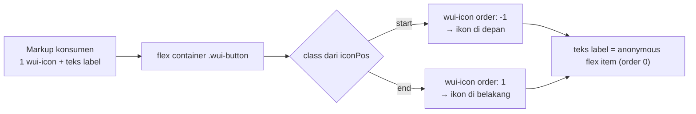

# Planning — Ikon di dalam Button (Material 3) `@wajek/wui`

> Tujuan: **satu ikon** di dalam `[wuiButton]` dengan sisi yang ditentukan **dari tombol**
> (`iconPos="start" | "end"`) — posisi visual diatur CSS (`order`), bukan urutan markup.
> `WuiButton` tetap **directive** pada `<button>` native: tanpa component, tanpa `ng-content`.

Status: **Draft revisi 3 untuk direview** — belum ada file yang dibuat/diubah.
Revisi 2 (17 Sep 2026) atas permintaan user: **tanpa konversi ke component**, cukup tambahan CSS untuk
posisi ikon, dan `WuiButtonIcon` dihapus bila memungkinkan. Warna ikon `inherit` dari induk sudah beres
(`components/_icon.scss`) — tidak disentuh.
Revisi 3 (17 Sep 2026): setelah melihat hasil, user memutuskan **`icon` naik ke tangga
20/24/28/32px** (md = 1.5rem jadi jangkar) dan label tombol memakai **`line-height` dari map tombol**
(20/24/28/32px, md = 1.5rem) — lihat §3.3.
Revisi 4 (17 Sep 2026): **padding dibuat simetris** (tidak ada lagi sisi ikon yang lebih rapat) →
token `padding-icon`, CSS variable `--wui-button-padding-icon`, dan aturan `:has(> wui-icon)` dihapus.
Verifikasi ulang di browser sudah dijalankan — lihat §6.
Revisi 5 (17 Sep 2026): **ikon-saja** dikerjakan (input `iconOnly` → tombol persegi, §3.6) dan
**dukungan `<a>`** dirapikan (underline dimatikan + `aria-disabled`, §3.7). Verifikasi di browser: §6.
Sumber: anatomy tombol M3 (container + label + ikon, padding sisi ikon lebih rapat, jarak ikon ↔ label 8dp).
Dokumen terkait: `docs/planning/wui-button-plan.md` (**G3 = dokumen ini**; G1 & G2 selesai),
`docs/planning/scss-structure-plan.md`, `docs/planning/scss-color-palette-plan.md`.

---

## 0. Lingkup

| Masuk lingkup | Di luar lingkup (dicatat untuk nanti) |
| --- | --- |
| `iconPos` bernilai `start` atau `end` di `WuiButton` (tetap directive) | Konversi ke `@Component` + `ng-content` (ditolak user) |
| Sisi ikon lewat `order` — urutan markup jadi tidak relevan | Pembungkusan label otomatis / `[wuiButtonLabel]` manual (hanya jalur cadangan §3.4) |
| Ukuran ikon + `line-height` label satu tangga (20/24/28/32px) | Dua ikon sekaligus, animasi ikon, spinner/loading |
| Padding **simetris** untuk semua varian (keputusan revisi 4) | Varian `elevated`/`tonal`, shape `square` + morph (G4), FAB/toggle |
| **Ikon-saja** lewat input `iconOnly` → tombol persegi (revisi 5) | Target sentuh 48dp untuk ikon-saja `sm` (masih ditunda) |
| **Dipakai pada `<a>`** — underline dimatikan, `aria-disabled` (revisi 5) | Ikon di luar tombol atau ikon non-`wui-icon` |

---

## 1. Kondisi sekarang

**Sudah ada dan bisa dipakai:**

| Aset | Lokasi | Dipakai untuk |
| --- | --- | --- |
| Directive `WuiButton` (`[wuiButton]`, input `variant`/`size`) | `projects/wui/src/button/button.ts` | Tempat menempel input `iconPos` (BC2) |
| Token `padding` + `icon` + `line-height` per ukuran | `abstracts/_tokens.scss` → `$wui-button-sizes` | Padding, ukuran ikon & tinggi baris label |
| `--wui-button-icon-size`, `--wui-button-line-height` | `components/_button.scss` (4 ukuran) | Sudah ter-emit & terpakai |
| `wui-icon`: `aria-hidden`, `fill: currentColor`, warna `inherit` dari induk, membaca `--wui-icon-size` (fallback 24px) | `src/icon/*`, `components/_icon.scss` | Ukuran & warna ikon otomatis ikut tombol — **tidak perlu diubah** |
| `--wui-space-2` (8px) | `themes/_light-theme.scss` | Jarak ikon ↔ label |

**Belum ada — temuan penting (harus dibereskan di G3, bukan sekadar menambah input):**

| # | Temuan | Bukti | Akibat sekarang |
| --- | --- | --- | --- |
| T1 | **Tidak ada satu pun aturan CSS untuk ikon di tombol** — class `.wui-button-icon` bahkan tidak pernah di-style | `grep -r wui-button-icon projects/wui/scss` → hanya `--wui-button-icon-size` | Directive `WuiButtonIcon` **nol efek** (memasang class yang tidak dibaca siapa pun) → aman dihapus (BC3) |
| T2 | `--wui-button-icon-size` tidak pernah dikonsumsi | `wui-icon` membaca `--wui-icon-size`, bukan varian tombol | Ikon di tombol selalu 24px (fallback), tidak ikut `size` tombol |
| T3 | `padding-icon` tidak dipakai | tidak ada `padding-inline-*: var(--wui-button-padding-icon)` | Dulu dianggap cacat (sisi ikon seharusnya 16px); **revisi 4**: padding justru diputuskan simetris, jadi token `padding-icon` dihapus seluruhnya |
| T4 | `gap` belum ada di `.wui-button` | `_button.scss` tidak punya deklarasi `gap` | Jarak ikon ↔ label 0px |
| T5 | Sisi ikon ditentukan **urutan markup** | doc-comment `button-icon.ts` | Tidak ada kontrol dari tombol; ikon "end" hanya kebetulan rapi |

> Catatan: dokumen `wui-button-plan.md` §2.3 menutup B11 dengan "struktur disiapkan sekarang, tanpa
> menyentuh markup ikon". T1–T4 menunjukkan strukturnya sudah disiapkan (token & CSS variable),
> **tetapi belum disambungkan**. Itulah inti G3.

---

## 2. Keputusan yang perlu dikunci

| # | Keputusan | Rekomendasi saya |
| --- | --- | --- |
| BC1 | Bentuk `WuiButton` | **Tetap `@Directive`** pada `<button>`/`<a>` native (B1 di `wui-button-plan.md` tidak diubah): tanpa component, tanpa `ng-content` |
| BC2 | API sisi ikon | Input `iconPos` di tombol — nilai `start` (default) atau `end`; host class `wui-button--icon-start` / `--icon-end`. Tidak ada input posisi di ikon |
| BC3 ✅ | Nasib `WuiButtonIcon` | **Hapus** — disetujui 17 Sep 2026: `button-icon.ts`, ekspornya di `public-api.ts`, dan pemakaiannya di halaman demo. Efek visualnya nol (T1) sehingga tidak ada regresi; catat di README bahwa class `.wui-button-icon` tidak ada lagi |
| BC4 ✅ | Cara memilih ikon | Selektor elemen `.wui-button > wui-icon` — tanpa atribut penanda — **disetujui 17 Sep 2026**, termasuk konsekuensinya: **ikon wajib anak langsung tombol** |
| BC5 | Cara memindah sisi | `order` pada elemen ikon: `start` → `order: -1`, `end` → `order: 1`. Label berisi teks = *anonymous flex item* (`order: 0`), jadi ikut tergeser tanpa dibungkus apa pun |
| BC6 ⛔ | Padding sisi ikon | Dulu asimetris (`padding-icon` di sisi ikon). **Digantikan revisi 4**: padding dibuat **simetris** untuk semua varian; token `padding-icon` dan aturan `:has(> wui-icon)` dihapus |
| BC7 ✅ | Ikon-saja (tombol kotak) | **Ditunda** (disetujui 17 Sep 2026). Tanpa wrapper label, CSS tidak bisa membedakan "ikon + teks" dari "ikon saja" (teks = anonymous flex item, tak bisa jadi patokan `:empty`). Bila nanti perlu → input eksplisit `iconOnly` di tombol, bukan `:has()` |
| BC8 | Class baru | Hanya modifier posisi (`--icon-start`/`--icon-end`); tidak ada class baru untuk ikon/label → utang penamaan `.wui-button__icon` di README tidak relevan lagi |
| BC9 | Penempatan blok SCSS | Blok ikon ditaruh **setelah** loop `@each` ukuran, supaya menang atas `padding-inline` dasar & modifier ukuran tanpa `!important` |
| BC10 | Demo & dokumen | Halaman demo §4 memakai `iconPos` (bukan urutan markup); tabel modifier dapat baris `iconPos`; README (G5) menjelaskan syarat anak langsung |
| BC11 | Ikon-saja: cara menandai | **Input `iconOnly`** (atribut tanpa nilai, lewat `booleanAttribute`) → host class `wui-button--icon-only`. Deteksi otomatis (baca `textContent` dari `ElementRef`) ditolak: butuh DOM-poking, tidak reaktif saat label di-`@if`, dan gagal senyap |
| BC12 | Dukungan `<a>` | `[wuiButton]` sudah cocok untuk elemen apa pun; yang perlu ditambah cuma `text-decoration: none` di reset `.wui-button`, plus `[aria-disabled='true']` yang ikut aturan disabled (+ `pointer-events: none`) |

> Status keputusan: **BC3, BC4, BC6 disetujui; BC7 ditunda; cakupan browser = Baseline** (17 Sep 2026).
> Tidak ada keputusan yang menggantung — plan ini sudah dieksekusi (lihat §5).

**V2 ✅** — `:has(> wui-icon)` sudah diuji terhadap konfigurasi stylelint repo (spike `/tmp`, 17 Sep
2026): lolos tanpa error selector. Artinya `:has()` bukan penghalang lint di proyek ini.

---

## 3. Rancangan teknis

### 3.1 API & DOM

**Sekarang** — sisi ikon ditentukan urutan markup, tanpa kontrol dari tombol:

```html
<button wuiButton>
  <wui-icon wuiButtonIcon icon="home"></wui-icon>
  Beranda
</button>

<button wuiButton variant="outlined">
  Pengaturan
  <wui-icon wuiButtonIcon icon="settings"></wui-icon>
</button>
```

**Setelah** — sisi ikon ditentukan tombol (`iconPos`), markup bebas urutan, tanpa directive penanda:

```html
<button wuiButton iconPos="start">
  <wui-icon icon="home"></wui-icon>
  Beranda
</button>

<!-- ikon ditulis SESUDAH label, tetapi tampil di DEPAN karena iconPos="start" -->
<button wuiButton variant="outlined" iconPos="start">
  Pengaturan<wui-icon icon="settings"></wui-icon>
</button>

<button wuiButton variant="text" iconPos="end" size="lg">
  Kirim<wui-icon icon="send"></wui-icon>
</button>
```

**DOM hasil render** — tidak ada elemen tambahan, persis markup konsumen (hanya class modifier
posisi yang ditambahkan):

```html
<button class="wui-button wui-button--outlined wui-button--lg wui-button--icon-end">
  <wui-icon icon="settings">…</wui-icon>
  Pengaturan
</button>
```



Kunci desain: ikon dan teks label sama-sama flex item; teks label selalu ber-`order: 0`
(*anonymous flex item*), jadi cukup menggeser `order` ikon ke `-1` (start) atau `1` (end) untuk
menempatkannya di sisi mana pun — **tanpa membungkus label** dan **tanpa mengubah markup**.

### 3.2 Angular — tetap directive

`projects/wui/src/button/button.options.ts` — tambah tipe:

```ts
/** Sisi ikon di dalam tombol. Disetel dari tombol (`iconPos`), bukan dari ikonnya. */
export type WuiButtonIconPos = 'start' | 'end';
```

`projects/wui/src/button/button.ts` — tetap `@Directive`; hanya tambah 1 input + 2 host binding:

```ts
@Directive({
  selector: '[wuiButton]',
  host: {
    class: 'wui-button',
    '[class.wui-button--filled]': "variant() === 'filled'",
    '[class.wui-button--outlined]': "variant() === 'outlined'",
    '[class.wui-button--text]': "variant() === 'text'",
    '[class.wui-button--sm]': "size() === 'sm'",
    '[class.wui-button--md]': "size() === 'md'",
    '[class.wui-button--lg]': "size() === 'lg'",
    '[class.wui-button--xl]': "size() === 'xl'",
    '[class.wui-button--icon-start]': "iconPos() === 'start'",
    '[class.wui-button--icon-end]': "iconPos() === 'end'",
  },
})
export class WuiButton {
  readonly variant = input<WuiButtonVariant>('filled');
  readonly size = input<WuiButtonSize>('md');
  /** Sisi ikon. Hanya terasa bila tombol punya `<wui-icon>` sebagai anak langsung. */
  readonly iconPos = input<WuiButtonIconPos>('start');
}
```

Catatan penting:

- Class `--icon-start`/`--icon-end` **selalu** ter-emit (default `start`), termasuk pada tombol tanpa
  ikon. Aman, karena semua aturan ikon di §3.3 di-scope ke `> wui-icon` — tombol biasa tidak berubah.
- Host tetap `<button>`/`<a>` native → `disabled`, `type`, `form`, `routerLink`, `aria-*`, dan class QA
  (`is-hover`/`is-pressed`) tidak tersentuh.
- Tidak ada template → tidak ada `imports` tambahan dan tidak ada perubahan lifecycle/CD.

**Dihapus (BC3):** `projects/wui/src/button/button-icon.ts`, baris `export * from './button/button-icon';`
di `public-api.ts`, serta impor & pemakaian `WuiButtonIcon` di
`src/app/pages/button/button.page.ts` + `button.page.html`.

### 3.3 SCSS (`projects/wui/scss/components/_button.scss`)

**(a) `gap` di `.wui-button`** (menyusul deklarasi `justify-content`):

```scss
        // Jarak ikon ↔ label (M3: 8dp). Terasa hanya bila tombol punya ikon + label.
        gap: var(--wui-space-2);
```

**(b) Blok ikon — ditaruh SETELAH loop `@each` ukuran (BC9):**

```scss
    // ── Ikon ────────────────────────────────────────────────────────────────
    // Sisi ikon ditentukan `iconPos` (class di host), BUKAN urutan markup. Ikon dan teks label
    // sama-sama flex item: teks label adalah *anonymous flex item* yang selalu ber-`order: 0`,
    // jadi `order: -1` / `order: 1` cukup untuk memindahkan ikon ke depan/belakang.
    // `order` dipilih, bukan `flex-direction: row-reverse`, supaya padding logical & gap tidak
    // ikut terbalik.
    .wui-button--icon-start > wui-icon { order: -1; }
    .wui-button--icon-end > wui-icon { order: 1; }

    // Ikon ikut ukuran tombol. `wui-icon` membaca `--wui-icon-size` dari elemennya sendiri
    // (fallback 24px), jadi cukup disetel di elemen ikon. `flex: none` mencegah svg diperas
    // flexbox saat label panjang.
    .wui-button > wui-icon {
        --wui-icon-size: var(--wui-button-icon-size);

        // Baris kosong di atas WAJIB: `declaration-empty-line-before` menolak deklarasi biasa
        // yang menempel langsung di bawah custom property (dibuktikan lewat spike lint).
        flex: none;
    }

    // Padding tombol SENGAJA simetris (revisi 4): sisi ikon memakai nilai yang sama dengan sisi
    // label, jadi tidak ada aturan padding khusus ikon. Ikon hanya mengatur `order`, ukurannya,
    // dan jarak antar-item lewat `gap` tombol.
```

Angka yang berlaku (dari `$wui-button-sizes`, tanpa token padding khusus ikon):

| Ukuran | `padding` (filled/outlined) | `padding-text` (text) | `icon` | `line-height` label |
| --- | --- | --- | --- | --- |
| `sm` | 16 | 8 | 20px (1.25rem) | 20px (1.25rem) |
| `md` | 24 | 12 | 24px (1.5rem) | 24px (1.5rem) |
| `lg` | 28 | 16 | 28px (1.75rem) | 28px (1.75rem) |
| `xl` | 32 | 20 | 32px (2rem) | 32px (2rem) |

Kedua kolom terakhir **sengaja memakai tangga yang sama**, dan itu bagian dari desainnya:

- Tinggi baris label = `line-height` kotak teks; ukuran ikon = tinggi kotak ikon. Kalau keduanya sama,
  kedua flex item kongruen sehingga `align-items: center` menyejajarkannya presisi (sisa ruang terbagi
  rata: md `(40 − 24) / 2 = 8px` di atas dan di bawah; sm `6px`, lg `10px`, xl `12px`).
- `line-height` peran tipografi (`label-large` = 20px) **dikalahkan** oleh token tombol, karena
  `line-height: var(--wui-button-line-height)` ditulis setelah `@include a.typography(...)`.
- `icon` menyalin tangga yang dipilih user (md 1.5rem) dengan langkah 4px; rasionya ke tinggi tombol
  turun konsisten: 62.5% (sm) → 60% → 58% → 57%. Alternatif proporsional murni (0.6 × tinggi) akan
  memberi 19.2/24/28.8/33.6px — **tidak** dipakai karena keluar dari angka bulat.

Kepastian sisi untuk **kedua** urutan markup — inilah janji `iconPos`:

| Urutan markup | `iconPos="start"` | `iconPos="end"` |
| --- | --- | --- |
| ikon → label | ikon, label | label, ikon |
| label → ikon | ikon, label | label, ikon |

Karena `order: -1` (ikon) < `0` (teks) < `order: 1` (ikon), posisi visual **tidak lagi bergantung**
pada tempat ikon ditulis di markup.

### 3.4 Jalur cadangan bila `order` tidak bekerja pada teks

> **Tidak dipakai**: V1 sudah terbukti (uji spike + pengukuran komponen nyata — lihat §5), jadi label
> tetap tidak perlu dibungkus. Bagian ini disimpan hanya sebagai catatan bila suatu saat target browser
> berubah.

Rencana ini bergantung pada `order: 0` untuk *anonymous flex item* (teks label tanpa wrapper). Itu
perilaku yang diatur spesifikasi flexbox, tetapi **diverifikasi lebih dulu** di G3.1 (§6, V1). Bila
ternyata tidak diurutkan sesuai harapan, jalur cadangannya adalah membungkus label:

```html
<button wuiButton iconPos="end">
  <wui-icon icon="settings"></wui-icon>
  <span wuiButtonLabel>Pengaturan</span>
</button>
```

```scss
    // Menggantikan pasangan `order` di §3.3(b): label jadi elemen nyata ber-`order`, ikon digeser
    // lebih jauh supaya tidak seri dengan label.
    .wui-button > [wuiButtonLabel] { order: 1; }
    .wui-button--icon-start > wui-icon { order: -1; }
    .wui-button--icon-end > wui-icon { order: 2; }
```

Konsekuensinya `[wuiButtonLabel]` jadi **wajib** agar `iconPos` benar — itulah biaya cadangan ini,
sehingga hanya dipakai kalau V1 gagal.

### 3.5 Aksesibilitas

- Ikon dekoratif: `wui-icon` sudah `aria-hidden="true"` + `focusable="false"` → tidak ada suara ganda.
- `order` hanya memindahkan visual; **urutan DOM tidak berubah** (tetap seperti markup), jadi urutan
  baca dan urutan seleksi teks konsisten dengan yang ditulis konsumen.
- Konsekuensi `order`: sisi visual bisa berbeda dari sisi baca (mis. `iconPos="start"` sedangkan ikon
  ditulis setelah label). Karena ikon `aria-hidden`, tidak ada informasi yang hilang.
- Cincin fokus (`a.focus-ring`), `:active`, dan `:disabled` tidak terpengaruh — tidak ada elemen
  tambahan yang masuk urutan tab.
- `disabled`/`type`/`form` tetap atribut host native (B1 tidak berubah).
- Ikon-saja **sudah dikerjakan** (revisi 5, §3.6): wajib `aria-label`, bentuknya persegi.
- Tombol ikon-saja `sm` (32px) masih di bawah target sentuh 48dp M3 — ditunda (BI8).

### 3.6 Ikon-saja (revisi 5)

```html
<button wuiButton iconOnly aria-label="Beranda">
  <wui-icon icon="home"></wui-icon>
</button>
```

```scss
    .wui-button--icon-only {
        width: var(--wui-button-height);
        padding-inline: calc((var(--wui-button-height) - var(--wui-button-icon-size)) / 2);
    }
```

- Persegi **tanpa token baru**: padding = (tinggi − ikon) / 2 → md `(40 − 24) / 2 = 8px`, sm 6px,
  lg 10px, xl 12px. Nilainya otomatis ikut kalau token ukuran diubah.
- `.wui-button--icon-only` (0,1,0) ditulis **setelah** varian & loop ukuran, jadi menang atas
  `padding-inline` varian `text` pada specificity yang sama.
- Kenapa penanda eksplisit, bukan otomatis: CSS tidak punya cara menguji keberadaan teks, dan
  membaca `textContent` lewat `ElementRef` tidak reaktif saat label berubah/`@if` — penanda eksplisit
  juga memaksa keputusan `aria-label`.

### 3.7 Dipakai pada `<a>` (revisi 5)

```html
<a wuiButton variant="outlined" iconPos="end" routerLink="/tipografi">
  Tipografi<wui-icon icon="home"></wui-icon>
</a>
```

- Selector tetap `[wuiButton]` → `<a>` sudah cocok tanpa perubahan API; yang kurang hanya reset dan
  state disabled:

```scss
    // di blok `.wui-button`
    text-decoration: none;   // mematikan underline bawaan link

    &:disabled,
    &[aria-disabled='true'] { cursor: default; }

    // `<a>` tidak mengenal `:disabled` — tiru perilakunya.
    &[aria-disabled='true'] { pointer-events: none; }
```

- Aturan warna disabled di ketiga varian juga menerima `&[aria-disabled='true']`.
- Yang **tidak** berlaku di `<a>`: `disabled`, `type`, `form`. Konsumen menambah `tabindex="-1"`
  bila link tidak aktif harus keluar dari urutan tab.

---

## 4. Struktur file (target)

| File | Perubahan |
| --- | --- |
| `projects/wui/src/button/button.ts` | Input `iconPos` + 2 host class binding, dan (revisi 5) input `iconOnly` + host class `--icon-only` — tetap `@Directive` |
| `projects/wui/src/button/button.options.ts` | Tipe baru `WuiButtonIconPos` |
| `projects/wui/src/button/button-icon.ts` | **Dihapus** (BC3) |
| `projects/wui/src/public-api.ts` | Hapus `export * from './button/button-icon';` |
| `projects/wui/scss/components/_button.scss` | `gap`, blok ikon (`order`, `--wui-icon-size`, `line-height`), blok ikon-saja, `text-decoration: none`, `[aria-disabled='true']` |
| `src/app/pages/button/button.page/button.page.ts` | Buang `WuiButtonIcon` dari `imports` |
| `src/app/pages/button/button.page/button.page.html` | Bagian 4 diperbarui (tanpa `wuiButtonIcon`, `iconPos`, contoh ikon-saja) + bagian 6 baru untuk `<a wuiButton>` + tabel modifier |
| `src/app/pages/home/home.page/*` | Buang `WuiButtonIcon` dari `imports` + atribut `wuiButtonIcon` di markup (tidak tercatat di draft awal) |
| `projects/wui/scss/abstracts/_tokens.scss` | Komentar `icon` tidak lagi merujuk `WuiButtonIcon`; kunci baru `line-height` + `icon` tangga 20/24/28/32px (revisi 3) |
| `projects/wui/scss/components/_icon.scss` | Komentar dirapikan (2 pelanggaran lint dari editan sebelumnya) — tanpa perubahan perilaku |
| `projects/wui/README.md` | ⬜ **Belum** — README belum punya bagian tombol sama sekali; panduan ikon (`iconPos`, syarat anak langsung, hilangnya `.wui-button-icon`) menyusul bersama G5 di `wui-button-plan.md` |
| `docs/planning/wui-button-plan.md` | Baris G3 menunjuk dokumen ini |

---

## 5. Fase kerja

| Fase | Isi | Keluaran | Status |
| --- | --- | --- | --- |
| **G3.1** | Uji V1 di browser (spike + pengukuran komponen), input `iconPos` + tipe `WuiButtonIconPos` + 2 host class, hapus `WuiButtonIcon` (file, ekspor, pemakaian di demo & home) | `import type` + host class terpasang; `grep` bersih | ✅ |
| **G3.2** | CSS ikon: `gap`, `--wui-icon-size`, `order`, padding sisi ikon (asimetris) | Ikon mengecil mengikuti `size` & sisi ikon lebih rapat | ✅ |
| **G3.3** | Halaman demo §4 (5 contoh + `disabled`) + tabel modifier `iconPos` | Terverifikasi terukur di browser | ✅ |
| **G3.5** | (revisi 5) Ikon-saja lewat input `iconOnly` + dukungan `<a>` (underline & `aria-disabled`) + contoh di demo | Tombol persegi 32/40/48/56 & link ber-ikon | ✅ |
| **G3.4** | README (panduan ikon + syarat anak langsung) | Panduan konsumen | ⬜ **menyusul bersama G5** — README belum punya bagian tombol sama sekali, jadi tidak dipecah ke sini |

**Catatan hasil G3.1–G3.3** — `npm run lint:styles` + `ng build wui` + `ng build --configuration development`
hijau. Pengukuran di browser pada halaman `/button` (dev server container):

| Tombol | `iconPos` | Ukuran | padding-inline start / end | Ikon |
| --- | --- | --- | --- | --- |
| filled **tanpa** ikon | (default) | md | 24px / 24px | — (tidak berubah) |
| filled berikon | `start` | md | **16px** / 24px | 18px, di depan |
| outlined berikon | `end` | md | 24px / **16px** | 18px, di belakang |
| text berikon (ikon ditulis **sesudah** label) | `start` | md | **16px** / 12px | 18px, di depan |
| outlined berikon | `start` | sm | 12px / 16px | 16px, di depan |
| filled berikon | `end` | lg | 28px / **20px** | 20px, di belakang |
| filled berikon `disabled` | `start` | md | 16px / 24px | warna `fill` = `color` tombol (38%) |

- **V1 terbukti dua kali**: spike HTML statis (ikon dengan `order: -1` di belakang teks tampil di depan;
  `order: 1` tampil di belakang) **dan** komponen nyata (ikon yang ditulis sesudah label tetap di depan
  untuk `iconPos="start"`). Jalur cadangan §3.4 tidak dipakai.
- Warna ikon sama sekali tidak disentuh: `fill` ikon identik dengan `color` tombol pada `filled`
  (`on-primary`) dan pada state `disabled`. Mode gelap & `.is-hover` masih penilaian manual.
- **Temuan di luar rencana 1**: sisa pemakaian `WuiButtonIcon` juga ada di `src/app/pages/home/home.page`
  → ikut dibersihkan (kalau tidak, build app gagal `TS2724`).
- **Temuan di luar rencana 2**: `components/_icon.scss` (hasil editan sebelumnya) melanggar dua rule
  stylelint (`scss/double-slash-comment-empty-line-before`, `scss/comment-no-empty`) sehingga lint merah
  tanpa kaitan dengan pekerjaan ini → komentarnya dirapikan, perilaku tidak diubah.

---

## 6. Verifikasi

```sh
docker exec -w /workspace wui_angular_dev sh -c "npm run lint:styles"
docker exec -w /workspace wui_angular_dev sh -c "npx ng build wui && npx ng build --configuration development"
docker exec -w /workspace wui_angular_dev sh -c "grep -o -- '\.wui-button[^{]*{[^}]*}' www/styles.css | grep -i icon"
docker exec -w /workspace wui_angular_dev sh -c "grep -o -- 'gap:[^;]*' www/styles.css | sort -u"
docker exec -w /workspace wui_angular_dev sh -c "grep -rn -e wuiButtonIcon -e WuiButtonIcon projects/wui/src src || echo 'BERSIH'"
```

| Cek | Hasil |
| --- | --- |
| Build & lint | ✅ `npm run lint:styles`, `ng build wui`, `ng build --configuration development` hijau (setelah revisi 4) |
| Sisa `WuiButtonIcon` | ✅ Bersih — `button-icon.ts` terhapus, ekspor + pemakaian (demo & home) dibuang |
| Sisa `padding-icon` | ✅ `grep -c padding-icon www/styles.css` → **0** (token & aturan asimetris benar-benar hilang) |
| Token ter-emit | ✅ `--wui-button-line-height` & `--wui-button-icon-size` = 1.25/1.5/1.75/2rem; `line-height: var(--wui-button-line-height)` muncul 5× (dasar + 4 ukuran) |
| Ukuran ikon (ukur di browser) | ✅ sm 20px · md 24px · lg 28px · xl 32px |
| `line-height` (ukur di browser) | ✅ sm 20px · **md 24px** · lg 28px · xl 32px = tinggi kotak ikon di tiap tingkatan |
| Padding simetris | ✅ md `24/24`, `text` md `12/12`, sm `16/16`, lg `28/28` — sama untuk tombol berikon maupun tanpa ikon |
| Kesejajaran (ukur di browser) | ✅ `center(ikon) = center(tombol) = center(tinta teks)` — md tepat sama (mis. 2100.5 / 2100.5 / 2100.5); sm/lg selisih 0.4px karena pembulatan subpixel |
| V1 | ✅ Terbukti: `order` menggeser ikon melewati *anonymous flex item* (ikon ditulis sesudah label tetap di depan untuk `iconPos="start"`) |
| V2 | ✅ `:has()` tidak lagi dipakai (revisi 4); sebelumnya terbukti lolos stylelint |
| V3 | ✅ `fill` ikon = `color` tombol pada `filled` & `disabled`; mode gelap masih manual |
| V4 | ✅ Gotcha `declaration-empty-line-before` terdokumentasi & lolos lint |
| Ikon-saja (ukur di browser) | ✅ md **40×40** padding 8px ikon 24px untuk ketiga varian; sm **32×32** padding 6px ikon 20px — persis `(tinggi − ikon) / 2` |
| `<a wuiButton>` (ukur di browser) | ✅ `text-decoration-line: none` pada semua contoh; warna ikut varian (filled `rgb(5, 0, 15)`, outlined/text `rgb(217, 208, 255)`) |
| `<a aria-disabled="true">` | ✅ Warna konten disabled (38%), `pointer-events: none`, `cursor: default` — link tidak bisa diklik |
| Link ikon-saja | ✅ `<a wuiButton iconOnly>` → 40×40 dengan ikon 24px, tanpa underline |
| V1 ✅ | Terbukti dua kali: spike HTML statis **dan** komponen nyata (detail di catatan hasil §5) |
| V2 ✅ | `:has()` lolos stylelint dan ter-emit: `wui-button--icon-start:has(> wui-icon)` |
| V3 ✅ | `fill` ikon = `color` tombol pada `filled` (`on-primary`) dan `disabled` (38%); mode gelap & `.is-hover` masih penilaian manual |
| V4 ✅ | Gotcha `declaration-empty-line-before` terdokumentasi & bentuk final lolos lint |

---

## 7. Risiko & jebakan

| Risiko | Detail | Mitigasi |
| --- | --- | --- |
| `order` pada *anonymous flex item* | Seluruh janji `iconPos` bergantung pada teks label ber-`order: 0`. Bila browser target tidak mengurutkannya, kedua posisi bisa salah | **V1 diuji lebih dulu** (spike `/tmp` di G3.1); jalur cadangan wrapper `[wuiButtonLabel]` ada di §3.4 |
| Ikon tidak anak langsung | Ikon yang dibungkus `<span>` atau elemen lain tidak dikenali (`order` & `:has(> wui-icon)` gagal senyap) | Dokumentasikan syaratnya di README; `order` sengaja di-scope `> wui-icon` agar tidak salah sasaran |
| `:has()` belum didukung / ditolak lint | Browser lama (Safari < 15.4) kehilangan padding asimetris & ukuran ikon | Cek stylelint (V2); bila perlu, padding sisi ikon bisa dipindah ke class yang di-emit TS (mis. `--with-icon`) tanpa mengubah JSX konsumen |
| Specificity kalah dari modifier ukuran | `.wui-button--sm` dideklarasikan **setelah** varian di file ini | Aturan ikon memakai 2 class + `:has()` (0,2,1) dan diletakkan setelah loop `@each` (BC9) |
| `padding-inline` shorthand vs longhand | Dasar tombol menulis `padding-inline`, aturan ikon menulis `padding-inline-start/end` | Bukan soal urutan tapi specificity — sudah dihitung di §3.3; dijaga tes visual 4 ukuran × 3 varian |
| Input `size` di `wui-icon` di dalam tombol | Inline style dari `icon.ts` **menang** atas `--wui-icon-size` | Dokumentasikan: di dalam tombol jangan pakai `size` pada `wui-icon` |
| Ikon `flex` menyusut | Label panjang bisa memeras `<svg>` tanpa `flex: none` | `.wui-button > wui-icon { flex: none }` |
| Menghapus `WuiButtonIcon` = breaking | Konsumen yang mengimpor `WuiButtonIcon` dari paket akan error kompilasi | Tidak ada efek visual (T1), tetapi tetap dicatat di README/changelog sebagai perubahan API |
| Sisi visual ≠ sisi baca | `order` tidak mengubah DOM, jadi urutan baca mengikuti markup | Ikon `aria-hidden` → tidak ada informasi hilang (§3.5) |
| Dua ikon | Keduanya mendapat `order` yang sama → menempel di sisi yang sama, label bisa diapit | Di luar lingkup; dokumentasikan "satu ikon per tombol" |
| Ikon-saja tidak didukung | Konsumen tidak bisa membuat tombol kotak lewat CSS tanpa penanda | BC7: tunda; kalau dibutuhkan → input eksplisit `iconOnly` |
| Arah RTL | Sisi visual harus ikut arah baca | `order` + `padding-inline-*` sepenuhnya logical (baris flex mengikuti `dir`), tidak ada nilai kiri/kanan hardcoded |
| Gotcha lint: deklarasi setelah custom property | `declaration-empty-line-before` menolak `flex: none` yang menempel di bawah `--wui-icon-size` | ✅ Terbukti lewat spike; bentuk final §3.3 menyisipkan baris kosong (pola yang sama sudah dipakai blok `.wui-button` sekarang) |
| `line-height` tidak memindahkan tinta teks | Menambah `line-height` memperbesar kotak baris **simetris** (half-leading), jadi posisi tinta glyph tidak berubah. Yang berubah: kotak teks kini kongruen dengan kotak ikon (dulu md: teks 20px vs ikon 24px) | ✅ Terukur: pada md, `center(ikon)` = `center(tinta teks)` = `center(tombol)` tepat sama — jadi tidak perlu koreksi optik lagi |
| Dev server menyajikan SCSS **lama** | Playground me-resolve `@wajek/wui/scss/wui.scss` dari `dist` lewat `stylePreprocessorOptions.includePaths`, dan `ng serve` **tidak** rebuild saat isi `dist` berubah. Gejalanya: halaman masih memakai `--wui-button-icon-size: 1.125rem` & `--wui-button-line-height` kosong (inilah sebab "md masih 20px") | Setiap selesai `ng build wui`, **restart `ng serve`** (atau sentuh berkas di `src/`) sebelum menilai hasil visual |
| Target sentuh ikon-saja | `sm` = 32×32px, di bawah 48dp M3 | Masih ditunda (BI8); sementara dicatat di label contoh demo |
| Ikon-saja tanpa `aria-label` | Tombol tanpa nama aksesibel (ikon `aria-hidden`) | Didokumentasikan di JSDoc + semua contoh demo memakai `aria-label` |
| `aria-disabled` pada `<a>` | `pointer-events: none` mematikan klik & hover, tetapi **tidak** mengeluarkan link dari urutan tab | Konsumen menambah `tabindex="-1"`; dicontohkan di demo & JSDoc |
| Sisa proses `ng serve` yatim | `docker exec` yang dihentikan bisa meninggalkan proses `ng serve` di container (pernah terjadi saat verifikasi) | Hentikan lewat `pkill -f 'port 4[3-4]00'`; port user (4200) tidak disentuh |

---

## 8. Yang saya butuhkan dari Anda

| # | Keputusan | Hasil |
| --- | --- | --- |
| BC3 | Hapus `WuiButtonIcon` (termasuk ekspornya) | ✅ disetujui & dikerjakan (17 Sep 2026) |
| BC4 | Selektor `wui-icon` + syarat anak langsung | ✅ disetujui & dikerjakan |
| BC2 | `iconPos` bernilai `start` (default) atau `end` | ✅ dipakai sebagaimana direncanakan |
| BC6 | `text` button berikon | ⛔ **Dibatalkan revisi 4** — padding dibuat simetris untuk semua varian |
| BC7 ✅ | Ikon-saja (tombol kotak) | **Dikerjakan di revisi 5** (semula ditunda) — penandanya input eksplisit `iconOnly`, bukan `:has()` |
| BC11 | Ikon-saja: cara menandai | ✅ **Input `iconOnly`** (`booleanAttribute`) → host class `--icon-only`; tombol persegi tanpa token baru |
| BC12 | Dukungan `<a>` | ✅ `text-decoration: none` + `[aria-disabled='true']` (ikut warna disabled & `pointer-events: none`) |
| — | Cakupan browser untuk `:has()` | ✅ Ikut rekomendasi: target default Angular (Baseline). `:has()` = Chrome 105+, Safari 15.4+, Firefox 121+ |
