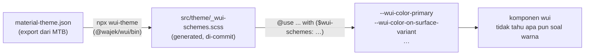

# Planning — Sumber warna dari Material Theme Builder (MTB) `@wajek/wui`

> Tujuan: **satu sumber warna per aplikasi.** Aplikasi memilih warna di *Material Theme Builder* (MTB)
> milik Google, mengekspor JSON, lalu sejak itu tidak mengurus color lagi: tidak menulis hex, tidak
> memilih tone, tidak menghitung persen `color-mix`. Yang berubah di aplikasi hanya **satu berkas
> generated** + **dua baris** di `src/styles.scss`.
>
> Bagian yang paling dulu dijawab dokumen ini memang yang Anda tanyakan: **bagaimana warna didefinisikan
> di `styles.scss` tiap project** (§2).

Status: **✅ SELESAI** — **F1 … F7 semuanya ✅** (generator ikut terbit di paket; rename `$wui-schemes`;
skema M3 45 peran + validator; komponen baca peran & `danger` → `error`; playground pakai berkas
generated; palet jadi data pasif bentuk MTB; dokumentasi ditulis ulang; plan struktur dipensiunkan).
Keputusan terkunci: M1–M9 (**M2 direvisi 22 Sep 2026**).

Yang **masih terbuka** (tidak menghalangi pemakaian): **K3** alias `background` (grep membuktikan tidak
ada pemakainya), **K9** ejaan `$wui-palletes`, **K10** peta sebagian vs merge dengan bawaan, plus utang kecil:
`scrim`/`shadow` belum dikonsumsi `$wui-overlay-color`/`$wui-elevation-*` (**K2** selesai: `success`/`warning`/`info` dihapus dari badge).

Pengetesan tetap milik user (`AGENTS.md` §1): seluruh fase di dokumen ini **ditulis**, tapi belum
di-lint/di-build/dilihat di browser oleh agent.
Semua pengetesan/pengukuran **dilakukan manual oleh user** (`AGENTS.md` §1) — dokumen ini hanya memuat
daftar periksa, bukan instruksi menjalankan build.

Prefix keputusan **M** — jangan dicampur dengan `C` (`docs/planning/wui-color-roles-plan.md`) atau
`S` (`docs/planning/wui-color-structure-plan.md`).

Dokumen terkait:

| Dokumen | Hubungan |
| --- | --- |
| `docs/planning/wui-color-structure-plan.md` | **DIGANTIKAN oleh plan ini (F7)** — perannya: menentukan nama peran (S1–S10). Disimpan sebagai riwayat; jangan dipakai sebagai acuan |
| `docs/planning/wui-color-roles-plan.md` | Mekanisme peran↔palet yang sudah jalan (C1–C19) |
| `docs/planning/scss-color-palette-plan.md` | Asal `$wui-palettes-*` / `$wui-palette` (F0–F1 ✅) |
| `docs/panduan-warna.md` | Kamus peran — artinya, bukan nilainya |
| `docs/panduan-scss.md` §5 | Kondisi warna sekarang |

---

## 0. Jawaban singkat

```scss
// src/styles.scss — aplikasi konsumen. Hanya ini yang berubah saat ganti warna brand.
@use './theme/wui-scheme' as theme;                              // 1. hasil generate (di-commit)
@use '@wajek/wui/scss/wui.scss' with ($wui-schemes: theme.$wui-schemes);  // 2. library memakai skema itu
```

Alur kerjanya tiga langkah:



Tiga fakta yang membuat rencana ini murah — bukan rombak besar:

1. **Mesinnya sudah ada.** `themes/_schemes.scss` (`$wui-schemes`) sudah menerima **warna langsung (hex) per
   peran per mode**. Skema MTB adalah persis itu: 46-an peran berisi hex untuk `light` dan `dark`.
   Jadi lapisan emit `--wui-color-*` **tidak perlu diubah** untuk jalur normal.
2. **Yang perlu dikerjakan tinggal nama peran.** Peran M3 (`error`, `on-surface-variant`,
   `surface-container-high`, `outline-variant`, …) sebagian belum ada di library. Daftar nama itu
   sudah diputuskan di `wui-color-structure-plan.md` (S1–S10) — plan ini **menyerapnya** (M3), bukan
   menyusun daftar baru.
3. **Mematikan skala tone tidak memutus apa pun** (hasil pemeriksaan 21 Sep 2026): tidak ada satu pun
   berkas di `projects/wui/scss/components/` maupun `src/` yang membaca `--wui-color-<palet>-<tone>`.
   Pemakainya hanya mesin `themes/_palette.scss` + `abstracts/_functions.scss` sendiri, halaman
   dokumentasi `/home`, dan `src/styles.scss`. Karena itu keputusan M6 (palet = data pasif) murah.

---

## 1. Kondisi sekarang & apa yang berubah

| Bagian | Sekarang | Setelah plan ini | Berubah? |
| --- | --- | --- | --- |
| Nilai peran | `$wui-schemes` default: `(palet, tone)` dari 4 palet placeholder | peta **scheme MTB** (`'light'`/`'dark'`) berisi hex per peran; default library = `default.json` (M9) | nilai & bentuk |
| Kontrak konfigurasi | `with ($wui-palette: 'purple')` + `$wui-roles` | `with ($wui-schemes: theme.$wui-schemes)` | ya — **rename** (M2 rev, breaking) |
| Nama peran | 10 peran + 3 turunan (`danger`, `on-surface-container`, …) | 45 peran M3 (S1–S10) | ✅ selesai di F2b |
| State layer | `color-mix(in srgb, var(--wui-color-<peran>) N%, transparent)` | sama | tidak |
| `disabled-*` | turunan `on-surface` 12%/38% | sama (ekstensi M3, cocok dengan spec) | tidak |
| Emisi mode gelap | `@media (prefers-color-scheme: dark)` | sama (varian kontras MTB ditunda — M5) | tidak |
| Skala tone `--wui-color-<palet>-<tone>` | di-emit: mode-aware, 11 tone `50…950`, plus salinan `-light-`/`-dark-` | **data pasif** — palet bawaan tetap ada (M9) dalam bentuk MTB absolut `0…100` (5 palet), tapi **tidak di-emit** & **tidak dipakai peran** (M6) | ✅ selesai di F5 |
| Komponen | masih menulis persen ad-hoc (`_table`, `_form-field`, `_sidenav`, `_loading`, `_badge`) | membaca peran (`outline-variant`, `on-surface-variant`, `surface-container-*`, `*-container`) | ✅ selesai di F3 |

**Yang tidak dikerjakan plan ini**: runtime theme picker (`data-theme`), varian kontras MTB
(`light-medium-contrast`, `dark-high-contrast`, dst.), dan `extendedColors` (bentuk isinya belum
diketahui — contoh JSON yang ada masih `[]`; jangan diimplementasikan sebelum ada contoh berisi).

---

## 2. Kontrak `styles.scss` per aplikasi (inti plan)

### 2.1 Berkas yang hidup di aplikasi

```
src/
  styles.scss                    ← 2 baris @use (ditulis sekali, tidak pernah diubah lagi)
  theme/
    material-theme.json          ← export dari MTB (sumber kebenaran, di-commit); nama bebas,
                                   contoh di repo ini: `src/theme/default.json`
    _wui-schemes.scss            ← GENERATED, jangan diedit tangan (di-commit)
```

Peran tiap berkas sengaja dipisah: JSON = **apa yang desainer/user putuskan**, `_wui-schemes.scss` =
**terjemahannya ke Sass**, `styles.scss` = **pemasangan ke library**. Hanya berkas generated yang
berubah ketika warna brand berganti.

### 2.2 `src/styles.scss`

```scss
// Style global aplikasi.
// Warna: sumbernya `src/theme/material-theme.json` (Material Theme Builder).
// Urutan wajib: berkas tema dimuat DULU, karena konfigurasi `with (…)` hanya boleh memakai
// variabel dari modul yang sudah dimuat.
@use './theme/wui-scheme' as theme;
@use '@wajek/wui/scss/wui.scss' with (
  $wui-schemes: theme.$wui-schemes,
);
```

Catatan:

- **Tidak ada `$wui-palette`** di jalur normal — defaultnya jadi `false` (M6), sehingga skala tone
  tidak di-emit sama sekali dan yang tersisa di CSS hanya peran. Kalau suatu saat skala mentah memang
  dibutuhkan, panggil alat manualnya: `@include themes.palette('brand', $tones);`.
- **Tidak ada `@include` apa pun.** Peran di-emit otomatis oleh `wui.scss` (kondisi sekarang sudah
  begini sejak F1 palet).
- `as theme` (bukan `as *`) supaya tidak ada tabrakan nama dengan fungsi/mixin library, sedangkan
  `@use '@wajek/wui/scss/wui.scss' as wui;` tetap bisa ditambah bila aplikasi mau memakai `a.space(…)`
  dsb.

### 2.3 `src/theme/_wui-schemes.scss` (contoh nyata dari export Anda)

Isi berkas ini dihasilkan generator dari `material-theme.json` yang Anda lampirkan (seed `#e50016`,
export 2026-09-21 03:19:11). Ini contoh **aplikasi yang punya brand sendiri** — berbeda dari default
library (§2.6). Nilainya **disalin apa adanya** — termasuk penyesuaian kontras yang sudah dihitung MTB:

```scss
// =============================================================================
// GENERATED — JANGAN DIEDIT TANGAN.
// Sumber : material-theme.json
// Seed   : #e50016        Export: 2026-09-21 03:19:11
// Alat   : @wajek/wui · bin/wui-theme.mjs
// Regenerate: npx wui-theme src/theme/material-theme.json
// =============================================================================

$wui-schemes: (
  'light': (
    'primary': #904a43,
    'on-primary': #fff,
    'primary-container': #ffdad5,
    'on-primary-container': #73342d,
    'secondary': #775652,
    'on-secondary': #fff,
    'tertiary': #715b2e,
    'error': #ba1a1a,
    'on-error': #fff,
    'error-container': #ffdad6,
    'on-error-container': #93000a,
    'surface': #fff8f7,
    'on-surface': #231918,
    'on-surface-variant': #534341,
    'outline': #857371,
    'outline-variant': #d8c2bf,
    'surface-container': #fceae7,
    'surface-container-high': #f6e4e2,
    'inverse-surface': #392e2d,
    'inverse-on-surface': #ffedea,
    'inverse-primary': #ffb4ab,
    'scrim': #000,
    'shadow': #000,
    // … total ±46 kunci per mode (daftar lengkap: §3.2)
  ),
  'dark': (
    'primary': #ffb4ab,
    'on-primary': #561e19,
    'primary-container': #73342d,
    'on-primary-container': #ffdad5,
    'secondary': #e7bdb7,
    'on-secondary': #442926,
    'tertiary': #e0c38c,
    'error': #ffb4ab,
    'on-error': #690005,
    'error-container': #93000a,
    'on-error-container': #ffdad6,
    'surface': #1a1110,
    'on-surface': #f1dedc,
    'on-surface-variant': #d8c2bf,
    'outline': #a08c8a,
    'outline-variant': #534341,
    'surface-container': #271d1c,
    'surface-container-high': #322826,
    'inverse-surface': #f1dedc,
    'inverse-on-surface': #392e2d,
    'inverse-primary': #904a43,
    'scrim': #000,
    'shadow': #000,
    // …
  ),
);

// Data rujukan — SENGAJA tidak dipakai library (M6). Isinya salinan mentah `palettes` dari JSON
// (skala absolut `0…100`, identik untuk kedua mode); gunanya dokumentasi & pemetaan balik ke MTB.
$wui-palletes: (
  'primary': (0: #000, 5: #2d0001, 10: #410002, 15: #540003, 20: #690005, /* … */ 100: #fff),
  'neutral': (0: #000, 5: #15100f, 10: #201a19, /* … */ 95: #fbeeec),
  // … primary, secondary, tertiary, neutral, neutral-variant × 18 tone
);
```

Dua hal yang wajib dipatuhi generator dan enak diperiksa manusia:

1. **Kunci peran selalu string berkutip** (`'on-primary'`). Tanpa kutip, `on-primary` dibaca Sass
   sebagai operasi, bukan kunci.
2. **Hex dipendekkan** — `#FFFFFF` → `#fff`, `#000000` → `#000` — karena stylelint repo memakai
   `color-hex-length: short` (pernah jadi 6 error di `_badge.scss`). Generator yang menulis `#FFFFFF`
   akan membuat `npm run lint:styles` merah.

### 2.4 Resep harian (ganti warna brand)

| # | Langkah | Perintah/berkas |
| --- | --- | --- |
| 1 | Pilih seed & ekspor di MTB → simpan JSON menimpa `src/theme/material-theme.json` | (manual, di browser MTB) |
| 2 | Regenerate berkas Sass | `npm run theme:build` |
| 3 | Selesai — build aplikasi seperti biasa | `ng build` |

Tidak ada komponen, token, atau `styles.scss` yang disentuh. Diff di git pun cuma satu berkas
generated, jadi review-nya gampang.

### 2.5 Kalau tidak mau memakai generator

Generator **bukan ketergantungan**, cuma penghemat kerja — tapi dalam praktik ia nyaris wajib:
`$wui-schemes` **menggantikan seluruh peta** (tidak digabung dengan bawaan), sedangkan
`$wui-role-required` sudah 18 peran dan bertambah setiap ada komponen yang mulai membaca peran baru.
Menulisnya tangan berarti ±40 baris per aplikasi.

Peta tulisan tangan **tetap sah** — bentuknya sama dengan yang dihasilkan generator, dan nilai sebuah
peran boleh `(palet, tone)`, warna langsung, string CSS, atau `false`:

```scss
// src/styles.scss — peta tangan: SEMUA peran `$wui-role-required` wajib ada
@use '@wajek/wui/scss/wui.scss' with (
  $wui-schemes: ( 'light': ( 'primary': #904a43, /* …18 peran wajib… */ ), 'dark': ( /* … */ ) ),
);
```

Validator (F2b) yang menjaga ini: peran wajib yang hilang **menggagalkan build** dengan pesan yang
menyebut namanya, karena `var(--wui-color-…)` yang tidak terdefinisi bukan error CSS — gejalanya cuma
elemen transparan atau divider tak terlihat. Lihat **K10** untuk usulan supaya peta sebagian bisa
(digabung dengan bawaan).

### 2.6 Default library — aplikasi tanpa konfigurasi

Library tetap punya **palet + skema default** (M9), dan keduanya sekarang berasal dari satu berkas MTB:
export `default.json` (seed `#593bb4`, export 2026-09-21 08:38:39). Jadi "tanpa konfigurasi" bukan lagi
nilai placeholder, melainkan tema M3 yang utuh:

```scss
// src/styles.scss — aplikasi yang memakai warna default library
@use '@wajek/wui/scss/wui.scss';
```

| Peran | light | dark |
| --- | --- | --- |
| `primary` | `#635690` | `#cdbdff` |
| `on-primary` | `#fff` | `#34275e` |
| `primary-container` | `#e7deff` | `#4a3e76` |
| `secondary` | `#615b71` | `#cac3dc` |
| `surface` | `#fdf7ff` | `#141318` |
| `on-surface` | `#1c1b20` | `#e6e1e9` |
| `surface-container` | `#f1ecf4` | `#201f24` |
| `outline` | `#79757f` | `#938f99` |
| `outline-variant` | `#cac4cf` | `#48454e` |

Berkas sumbernya hidup di library (mis. `projects/wui/scss/themes/_schemes-default.scss`) dan
**dihasilkan generator yang sama** seperti berkas tema aplikasi — tidak ada jalur khusus: default
library hanyalah "aplikasi pertama" yang memakai alat ini.

⚠️ **Nama palet MTB bentrok dengan nama peran** (`primary`, `secondary`, `tertiary` ada di kedua
 dunia). Karena M6 tidak meng-emit skala palet, bentrok itu tidak pernah sampai ke CSS dan peta datanya
 boleh memakai nama apa adanya dari JSON. Kalau suatu saat skala itu memang mau di-emit, namanya wajib
diganti lebih dulu — penjaganya sudah ada (`$wui-palette-reserved`).

⚠️ **Skala palet default sengaja tidak di-emit** (M6): `$wui-palette` tetap `false`. Jadi "ada palet
 default" berarti **datanya ada dan ikut dipelihara** (satu berkas dengan skemanya, bisa dipakai
 generator & jadi rujukan), bukan berarti ratusan `--wui-color-<palet>-<tone>` ikut masuk ke CSS.
 Kalau ternyata Anda memang mau skalanya tersedia di CSS, itu satu baris: `@include
themes.palette('brand', $tones);` dengan nama non-peran.

---

## 3. Model data MTB → token kita

Dua istilah dipakai persis seperti M3 — jangan dicampur, karena keduanya menunjuk benda berbeda:

| Istilah | Arti | Nama di kode |
| --- | --- | --- |
| **scheme** | satu set peran untuk **satu mode**; MTB mengekspor 6 (light, dark, 4 varian kontras) | `$wui-schemes`, kunci `'light'` / `'dark'` |
| **role** | satu entri warna **di dalam** sebuah scheme (`primary`, `on-surface-variant`, …) | `--wui-color-primary`, `$wui-state-layer-roles`, `$wui-role-required` |

Karena itu yang di-rename hanya nama **kontainer**-nya (M2 rev): fungsi/daftar yang memang menyebut
peran di dalam scheme (`role-value()`, `derived-roles()`, `state-layers()`, `$wui-state-layer-roles`,
`$wui-role-required`) **tetap** memakai kata *role*.

### 3.1 Apa isi JSON-nya

| Bagian | Isi pada file Anda | Dipakai? |
| --- | --- | --- |
| `seed`, `coreColors`, `description` | `#E50016`, tanggal export | ya — ditulis di header berkas generated (jejak) |
| `schemes` | 6 skema: `light`, `dark`, `light-medium-contrast`, `light-high-contrast`, `dark-medium-contrast`, `dark-high-contrast`; masing-masing **49 kunci** | **ya** — 2 skema pertama jadi sumber nilai peran |
| `palettes` | `primary`, `secondary`, `tertiary`, `neutral`, `neutral-variant`; masing-masing 18 tone (`0…100`) | ✅ data pasif (M6) — disalin ke berkas generated sebagai rujukan, **tidak** di-emit ke CSS. Palet **default** library juga dari sini (M9, `default.json`) |
| `extendedColors` | `[]` — **belum ada contoh berisi** | tidak (ditunda; bentuknya belum diketahui) |

Perhatikan: **`error` tidak punya palet sendiri** di `palettes`. Nilainya selalu datang dari `schemes`
(palet error M3 bersifat tetap). Ini alasan tambahan kenapa `schemes` harus jadi sumber nilai (M1).

### 3.2 Transformasi kunci: mekanis, tanpa tabel terjemahan

Nama kunci MTB → nama token kita ternyata **cukup diubah camelCase → kebab-case**:

| JSON MTB | kunci di `$wui-schemes` | `--wui-color-…` |
| --- | --- | --- |
| `onPrimary` | `'on-primary'` | `--wui-color-on-primary` |
| `onPrimaryContainer` | `'on-primary-container'` | `--wui-color-on-primary-container` |
| `onSurfaceVariant` | `'on-surface-variant'` | `--wui-color-on-surface-variant` |
| `surfaceContainerHighest` | `'surface-container-highest'` | `--wui-color-surface-container-highest` |
| `primaryFixedDim` | `'primary-fixed-dim'` | `--wui-color-primary-fixed-dim` |
| `outlineVariant` | `'outline-variant'` | `--wui-color-outline-variant` |

Jadi tidak ada tabel peran→tone buatan kita, dan tidak ada nama yang perlu "diterjemahkan" per kunci.
Peran yang **bukan** dari MTB (tetap milik kita, dihitung library) hanya:

| Peran ekstensi | Asal |
| --- | --- |
| `default`, `on-default` | netral untuk elemen interaktif (tombol `color="default"`, item sidenav) — ⏳ K7 |
| `disabled-container`, `disabled-content` | turunan `on-surface` + alpha 12%/38% (M3 menyetujui) |
| `state-layer-<peran>-opacity-08/10/16` | turunan di CSS dari `var(--wui-color-<peran>)` |

### 3.3 Kunci yang **tidak** dipakai (deprecated di M3)

| Kunci JSON | Alasan | Usul (K3) |
| --- | --- | --- |
| `background`, `onBackground` | deprecated; nilainya identik dengan `surface`/`onSurface` | dilewati generator, dicatat sebagai peringatan |
| `surfaceVariant` | deprecated (M3: pakai `surface-container-highest`) | dilewati |
| `surfaceTint` | deprecated (elevasi M3 tidak lagi memakai tint) | dilewati |

Selama satu mayor, library tetap meng-emit alias `--wui-color-background` /
`--wui-color-on-background` → `var(--wui-color-surface)` / `var(--wui-color-on-surface)` supaya
konsumen lama tidak pecah (menyatu dengan alias `danger` di K4 structure plan).

### 3.4 Peran add-on M3 yang kini "gratis"

Karena nilainya sudah ikut di `schemes`, peran yang dulu ditunda di structure plan §0 kini bisa
diadopsi tanpa menggambar apa pun: 12 `*-fixed*`, `scrim`, `shadow`, `surface-dim`/`surface-bright`,
dan 3 `inverse-*` (≈19 peran). Total peran yang di-emit menjadi ±46 per mode + 14 peran yang nilainya
sama di dua mode (12 fixed + `scrim` + `shadow`) — yang terakhir boleh di-emit sekali, atau dibiarkan
terduplikasi di blok dark demi kesederhanaan emitter (pilih salah satu di K4).

`scrim` & `shadow` sekaligus menutup temuan audit "hitam keras" (`$wui-overlay-color`,
`$wui-elevation-*`) yang dulu diusulkan jadi peran di K3 structure plan.

---

## 4. Keputusan yang sudah dikunci

| # | Keputusan | Alasan |
| --- | --- | --- |
| **M1** | **Sumber nilai peran = `schemes` MTB** (hex per peran per mode), bukan tabel peran→tone buatan kita | Skema MTB **bukan** hasil lookup tone. Bukti dari file Anda: `light.primary` = `#904A43` sedangkan palet `primary` tone 40 = `#8E4B44`; `light.onSurface` = `#231918` sedangkan `neutral` tone 10 = `#201A19`. MTB menyesuaikan hasilnya demi kontras, jadi menyalin tone apa adanya = warna yang **berbeda** dari yang dilihat desainer di MTB |
| **M2** *(revisi 22 Sep 2026)* | Kontrak warna aplikasi bernama **`$wui-schemes`** — mengikuti istilah MTB/M3, bukan `$wui-roles`. Modulnya ikut pindah nama: `themes/_roles.scss` → `themes/_schemes.scss` (+ `roles-for-mode()` → `schemes-for-mode()`, `role-value()` → `scheme-value()`); semua nama yang memang menunjuk *peran* tetap apa adanya | Alasan awal M2 (tidak menambah variabel baru) gugur: user memilih `$wui-schemes` supaya **satu kata dengan hasil export MTB** — `schemes` adalah nama objek di JSON, sedangkan `roles` hanya nama isinya. Konsekuensi: perubahan **breaking** → masuk bump **major** bersama rename `danger`→`error` |
| **M3** | Nama peran = **peran M3 apa adanya** (hasil transformasi §3.2); `danger` → `error` + alias satu mayor | Menyerap S1–S4 & S10; permintaan Anda = "jangan pusing mengurus color", dan itu hanya tercapai kalau nama peran sama dengan yang dipakai MTB/Figma |
| **M4** | Berkas generated **di-commit**; generator hanya alat bantu | Diff warna jadi terlihat di git, tidak butuh langkah generator saat build, dan proyek kecil boleh menulis peta itu tangan (§2.5) |
| **M5** | Mode tetap `prefers-color-scheme`; **4 varian kontras MTB + toggle manual ditunda** | Emisi 6 skema sekaligus melipatgandakan CSS dan membuka pertanyaan `color-scheme`; `prefers-contrast: more` bisa ditambah belakangan tanpa mengubah bentuk data (kunci `'light-medium-contrast'` cukup ditambahkan ke peta) |
| **M6** | **Palet jadi data pasif**: tetap didefinisikan (skala absolut `0…100` mengikuti `palettes` MTB) tapi **tidak di-emit** ke CSS dan **tidak dipakai peran**; seluruh penyebutan warna lewat peran (`--wui-color-*`) | Jawaban user (K2): *"palet tetap didefinisikan, tapi tidak berarti apa-apa; ingin penyebutan warna yang lebih semantik seperti roles"*. Terverifikasi tidak ada komponen yang membacanya (§0 fakta 3), jadi ini tidak memutus apa pun |
| **M7** | **Nilai default library ditunda**: kerjakan **strukturnya** dulu (bentuk peta `'light'`/`'dark'`, set kunci M3, nilai berupa hex), nilainya menyusul | Jawaban user (K6): *"saya akan definisikan nanti, yang penting struktur sudah mengikuti konvensi material theme builder"* — **dipenuhi oleh M9** |
| **M8** | `default`/`on-default` = **alias ke peran netral**, bukan lagi turunan `color-mix(on-surface 8%/14%, surface)`: `default` → `var(--wui-color-surface-container-high)`, `on-default` → `var(--wui-color-on-surface)` | Jawaban user (K7): *"untuk tombol default itu diganti neutral aja"*. Konsekuensi (dieksekusi di F2b): token `$wui-default-container-tint` **di-rename** jadi `$wui-surface-container-high-tint` — nilainya sama, tapi sekarang hanya dipakai sebagai *fallback* kalau skema belum punya `surface-container-high`. Tombol netral & item sidenav aktif memakai permukaan neutral M3. `-high` dipilih karena tintnya menengah — kalau setelah dilihat terlalu samar, naikkan ke `-highest` (satu baris) |
| **M9** | **Default library = `default.json`** (seed `#593bb4`): `$wui-schemes` default memakai hex dari `schemes.light`/`schemes.dark` berkas itu, dan **palet bawaan tetap ada** dalam bentuk MTB absolut `0…100` (5 palet: `primary`, `secondary`, `tertiary`, `neutral`, `neutral-variant`). `purple`/`red`/`magenta` placeholder dihapus | Jawaban user (K6 & K8): *"tetap ada palet default dong, sudah saya sertakan palet defaultnya"*. Hasilnya "tanpa konfigurasi" = tema M3 utuh (§2.6), bukan lagi nilai placeholder. Bawaannya **satu file MTB yang sama** untuk skema & palet, jadi tidak ada dua sumber yang bisa berbeda |

---

## 5. Opsi mekanisme input yang dibandingkan

| Opsi | Bentuk di `styles.scss` | Putusan |
| --- | --- | --- |
| **A — hex per peran** | `with ($wui-schemes: theme.$wui-schemes)` | ✅ **dipilih** (M1/M2). Setia 1:1 ke MTB, tidak ada tabel pemetaan yang bisa usang, emitter tidak berubah |
| **B — skala tone + tabel M3 milik library** | `with ($wui-palettes-extra: theme.$wui-palettes)`; library yang memetakan peran→tone | ❌ **ditolak**: hasilnya **tidak sama** dengan MTB (lihat bukti M1); selisih beberapa heks per peran = bug kontras yang sulit dilacak |
| **C — baca JSON saat runtime (fetch/TS)** | `provideWuiTheme(await fetch('material-theme.json'))` | ❌ ditolak: menambah beban runtime, FOUC, dan memindahkan warna dari CSS ke JS; MTB toh **compile-time** |
| **D — generator dipanggil sebagai bagian build** | Angular tidak punya hook pre-build SCSS | ❌ ditolak: menambah ketergantungan langkah build; commit berkas generated lebih sederhana (M4) |

---

## 6. Rencana fase

| Fase | Isi | Bergantung |
| --- | --- | --- |
| **F0** | Dokumen ini disepakati (K1–K7 terjawab). Tanpa perubahan kode | — |
| **F1** ✅ | Generator tema **di dalam paket**: `projects/wui/bin/wui-theme.mjs` + field `bin` di `projects/wui/package.json` + assets `"./bin/**/*.mjs"` di `ng-package.json`; skrip npm repo-side `theme:build`/`theme:check`. Baca JSON → tulis `_wui-schemes.scss`: header jejak (label, seed, sha256 sumber, perintah regenerate, daftar skema & kunci deprecated), 45 peran × 2 skema (hex pendek, kunci berkutip, dikelompokkan), `$wui-palletes` (5 palet × 18 tone; nama per 22 Sep 2026, lihat K9), `--check` (keluar 2 saat basi), `--unknown=error\|warn`. Path relatif **direktori kerja**. Dok: `docs/panduan-kerja.md` §5 | F0, K1 ✅ |
| **F2a** ✅ | **Rename kontrak & modul**: `$wui-roles` → **`$wui-schemes`**; `themes/_roles.scss` → **`themes/_schemes.scss`**; `roles-for-mode()` → `schemes-for-mode()`, `role-value()` → `scheme-value()`, mixin `roles()` → `schemes()`; parameter `$wui-mode-roles` → `$wui-scheme`. Nama yang memang menunjuk *peran* tetap: `derived-roles()`, `state-layers()`, `$wui-state-layer-roles`. Rujukan di komentar/`README`/playground/dokumen ikut diperbarui; plan lama yang bersifat riwayat **tidak** disentuh | F1 |
| **F2b** ✅ | (a) `$wui-schemes` bawaan = **skema M3 penuh 45 peran** (hex, `light`+`dark`, dari `default.json`) — bukan lagi 10 peran `(palet, tone)`; `danger`, `on-danger`, `on-surface-container` tidak ada lagi di bawaan. (b) **`$wui-role-required`** (9 peran yang dibaca komponen saat itu; **18** setelah F3/F4 menambah `on-surface-variant`, `outline-variant`, `surface-container-low`, dan `*-container`/`on-*-container`) + `scheme-validated()` → `@error` menyebut peran yang hilang **dan** pasangan `X`/`on-X`, `X-container`/`on-X-container`. (c) `$wui-state-layer-roles` jadi 8 peran (`primary`/`secondary`/`tertiary`/`error` + `on-*`); peran yang tidak ada di skema **dilewati** (bukan error) karena yang wajib sudah dijaga `$wui-role-required`. (d) M8: `default` → `var(--wui-color-surface-container-high)`; token `$wui-default-container-tint` → **`$wui-surface-container-high-tint`** dan kini hanya *fallback*. (e) **Alias satu mayor** `--wui-color-danger`/`-on-danger` → `var(--wui-color-error)`/`-on-error` supaya komponen (F3 belum jalan) tidak pecah. (f) `$wui-palette-reserved` = seluruh nama peran M3 + ekstensi. (g) README paket + `docs/panduan-scss.md` §5 diperbarui | F2a |
| **F3** ✅ | Komponen bersih dari persen ad-hoc & `danger` → `error`:
• `_table.scss` — divider 40%/65% → `outline-variant`; baris selang-seling 2% → `surface-container-low`; hover 4% → `surface-container` (kolom sticky ikut, karena butuh warna opaque).
• `_form-field.scss` — label 70%, hint 65%, placeholder 50% → `on-surface-variant`; border hover 45% → `on-surface-variant` (lebih tegas dari `outline` di terang **dan** gelap); invalid → `error`.
• `_sidenav.scss` — divider 12% → `outline-variant`; subheader 70% → `on-surface-variant`.
• `_badge.scss` — varian `subtle` pakai `*-container`/`on-*-container` (bukan tint 12%/22%); `default` → `surface-container-high`; `danger` → `error` + alias selector. Tiga varian status (`success`/`warning`/`info`) **tetap hex** karena bukan peran M3 (K2 di plan struktur masih terbuka) — ditandai komentar tegas, dan itu satu-satunya hex keras yang tersisa di komponen.
• `_loading.scss` — persen 20%/60% **dipertahankan** sebagai turunan `--wui-loading-color` (M3 tidak punya peran jalur spinner), sekarang berkomentar supaya tidak "diperbaiki" tanpa alasan.
• API — `WuiButtonColor`/`WuiBadgeColor` dapat `'error'` (nilai `'danger'` masih diterima; binding jadi `wui-button--color-error`/`wui-badge--error` dengan alias `--color-danger`/`--danger` di CSS); seluruh halaman demo memakai `error`.
• **Tidak** disentuh (dianggap batas yang sah): `box-shadow: inset … var(--wui-color-outline)` di `_sidenav.scss` dan `border-bottom` `_topbar.scss` — keduanya batas panel, bukan divider baris.
| F2 |
| **F4** ✅ | Playground memakai berkas generated: `src/styles.scss` jadi kontrak §2.2 — `@use './theme/wui-schemes' as theme;` + `@use '@wajek/wui/scss/wui.scss' with ($wui-schemes: theme.$wui-schemes);` (tanpa `$wui-palette`, tanpa contoh lama yang sudah tidak sah). Skrip npm `theme:build`/`theme:check` di root menunjuk `src/theme/default.json` supaya bisa dijalankan tanpa argumen. Sekaligus **koreksi daftar peran wajib**: F3 membuat komponen membaca `on-surface-variant`, `outline-variant`, `surface-container-low`, dan `*-container`/`on-*-container` (badge `subtle`) — ke-18-nya masuk `$wui-role-required` | F3 |
| **F5** ✅ | Palet jadi **data pasif** (M6/M9):
• `$wui-palettes-builtin` = **5 palet bentuk MTB** (`primary`, `secondary`, `tertiary`, `neutral`, `neutral-variant`), tone **absolut** `0…100` dari `default.json`, satu skala untuk kedua mode. Bentuk lama (`purple`/`red`/`magenta`/`neutral` mode-aware `50…950`) dibuang.
• `$wui-palette: false` (bawaan) → tidak ada skala yang di-emit, jadi nama bawaan yang sama dengan nama peran M3 tidak pernah sampai ke CSS.
• `themes/_palette.scss` menyusut: `palette-scale()` + `palette-mode-tones()` + `$wui-palette-required-tones` dihapus; `palette-tones()` kini memvalidasi peta `(tone: warna)`; `palette()` meng-emit sekali di `:root` (**tanpa** salinan `-light-`/`-dark-`, tanpa blok mode gelap); `all-palettes` melewati nama terlarang.
• `a.color($name, $tone)` & `a.color-raw($name, $tone)` kehilangan parameter `$mode`, begitu pula `scheme-value()`: `(palet, tone)` kini berarti **tone absolut**, jadi beda per mode ditulis sebagai pasangan berbeda (mis. `40` di `light`, `80` di `dark`).
• Dokumentasi ikut: halaman `/home` (contoh `styles.scss` + tabel opsi), komentar `wui.scss`, `docs/panduan-scss.md` §5.
| F4 |
| **F6** ✅ | Dokumentasi: `docs/panduan-warna.md` **ditulis ulang** — sekarang kamus 45 peran M3 lengkap (7 grup + add-on: tertiary, inverse, 12 fixed, `shadow`/`scrim`), 10 aturan umum (termasuk "nilai hanya datang dari skema" & validasi build), tabel ekstensi kita, daftar yang sengaja dilewati/masih terbuka, dan peta pemilihan cepat. `docs/panduan-scss.md` §5 sudah diperbarui di F5; `projects/wui/README.md` dapat cara pakai konsumen (`npx wui-theme` + skrip npm + 2 baris `styles.scss`) | F3, F4 |
| **F7** ✅ | `docs/planning/wui-color-structure-plan.md` diberi banner **"sudah digantikan"** + peta nasib keputusan (S1–S10, K1–K4, F3) supaya tidak dibaca sebagai rencana aktif; baris "dokumen terkait" di plan ini ikut diperbarui | F6 |

Prasyarat lint yang wajib diingat saat eksekusi: `scss/dollar-variable-pattern: ^wui-` (berlaku juga
untuk variabel lokal di dalam fungsi/mixin), `custom-property-pattern`, `color-hex-length: short`,
`scss/comment-no-empty`, dan `declaration-empty-line-before` (deklarasi tidak boleh menempel di bawah
custom property atau `@include`).

---

## 7. Yang belum dikunci

| # | Pertanyaan | Opsi | Usul |
| --- | --- | --- | --- |
| ~~K1~~ ✅ | Distribusi generator untuk aplikasi lain | — | **(b) dipilih**: generator **ikut terbit di dalam paket** (`bin/wui-theme.mjs` → `npx wui-theme`), jadi aplikasi konsumen "tinggal mengkonsumsi" tanpa menyalin skrip/JSON. Dua fakta terverifikasi dari sumber ng-packagr: field **`bin` dipertahankan** di manifest terbit (`packageJson = { ...entryPoint.packageJson, ... }`, dan `bin` tidak ada di daftar hapus), sedangkan field **`scripts` dibuang** — karena itu jalurnya `bin`, bukan skrip npm yang dititipkan |
| ~~K2~~ ✅ **M6** | Nasib skala tone `--wui-color-<palet>-<tone>` | — | **Jawaban user**: palet tetap didefinisikan tapi *tidak berarti apa-apa*; penyebutan warna harus semantik seperti peran → skala tone jadi **data pasif** (tidak di-emit, tidak dipakai peran) |
| **K3** | Kunci deprecated (`background`, `onBackground`, `surfaceVariant`, `surfaceTint`) | (a) dilewati + alias satu mayor · (b) dilewati tanpa alias | **(a)** — konsumen lama tidak pecah. **Generator sudah melewatinya sejak F1** (tercatat di header berkas generated). Soal alias: grep membuktikan **tidak ada** pemakai `--wui-color-background`/`--wui-color-text` — nama itu sudah hilang sejak rename ke `surface`/`on-surface` di rilis sebelumnya, jadi alias-nya kemungkinan tidak perlu. Menunggu keputusan: buang alias dari rencana, atau tetap sediakan untuk konsumen yang sangat lama |
| ~~K4~~ ✅ | Peran add-on (12 fixed, `scrim`, `shadow`, `surface-dim/bright`, 3 `inverse-*`) | — | **(a) di-emit semua** — terimplementasi di F2b: skema bawaan berisi 45 peran, termasuk seluruh add-on itu |
| ~~K5~~ ✅ | Perilaku saat peran yang dibutuhkan komponen tidak ada di peta aplikasi | — | **(a) dipilih & diimplementasikan di F2b**: `$wui-role-required` + `scheme-validated()` → `@error` menyebut peran yang hilang dan mengarahkan ke `npx wui-theme`. Peran **non-wajib** yang tidak ada hanya dilewati |
| ~~K6~~ ✅ **M9** | Warna default library (tanpa konfigurasi) | — | **Jawaban user**: nilai default = export `default.json` (seed `#593bb4`) yang dilampirkan — struktur MTB + nilai nyata sekaligus |
| ~~K7~~ ✅ **M8** | `default`/`on-default` (netral tombol & item sidenav aktif) | — | **Jawaban user**: *"diganti neutral aja"* → alias ke `surface-container-high` + `on-surface` (ubah tampilan tombol netral: sengaja) |
| ~~K8~~ ✅ **M9** | Nasib data palet bawaan (`purple`, `red`, `magenta`, `neutral` — bentuk **mode-aware** `50…950`) | — | **Jawaban user**: *"tetap ada palet default dong"* → palet bawaan dipertahankan, tapi di-reshape ke bentuk MTB absolut `0…100` dari `default.json` (5 palet) |
| **K9** | Ejaan variabel data palet di berkas generated: `$wui-palletes` (dipakai sejak 22 Sep 2026) atau `$wui-palettes` | (a) biarkan `$wui-palletes` · (b) ubah ke `$wui-palettes` | **(b)** — usul: `$wui-palletes` beda satu huruf dari `$wui-palettes` / `$wui-palettes-extra` / `$wui-palettes-builtin` yang sudah ada di library, jadi gampang tertukar dan gampang "diperbaiki" orang lain tanpa sengaja. Tapi ini penamaan yang Anda tulis, jadi menunggu keputusan (kalau (a), biarkan apa adanya dan jangan diseragamkan) |
| **K10** | Peta aplikasi **menggantikan** peta bawaan, jadi aplikasi yang cuma mau menukar 1–2 peran tetap harus menulis ±40 baris | (a) biarkan (generator jadi jalur wajib) · (b) `map.merge` dengan skema bawaan per mode: peran yang tidak ditulis mewarisi bawaan | **(b)** terasa lebih ramah (tidak ada yang "lupa" peran lalu build gagal), tapi ada dua efek: aplikasi **tidak bisa** mematikan peran (`false` jadi tidak mungkin untuk peran yang ada di bawaan), dan identitas "warna saya" jadi samar karena sebagian nilai datang dari library. Menunggu keputusan |

---

## 8. Alternatif yang ditolak

| Alternatif | Alasan ditolak |
| --- | --- |
| Membiarkan aplikasi menulis `$wui-schemes` per peran sendiri (tanpa MTB) | Itu kondisi hari ini; user tetap harus memilih 46 warna dan mengurus kontras sendiri — persis yang mau dihapus |
| Menyalin **semua 6 skema** MTB sekarang | Melipatgandakan CSS; `prefers-contrast` belum ada kebutuhannya (M5) |
| Menghitung peran dari `seed` di Sass (generator tone sendiri) | Membangkitkan ulang algoritma HCT/`material-color-utilities` = proyek baru, dan hasilnya pasti berbeda dari MTB |
| Menyimpan JSON sebagai satu-satunya sumber dan mem-parse-nya dari Sass | Sass tidak bisa membaca JSON |
| Memakai `extendedColors` sekarang | Bentuk isinya belum diketahui (contoh yang ada masih kosong) — implementasi akan menebak-nebak |
| Menjadikan generator sebagai ketergantungan build | Menambah langkah build yang tidak ada hook-nya di Angular (opsi D §5); commit berkas generated lebih sederhana & bisa direview |

---

## 9. Risiko

1. **Perubahan visual yang disengaja.** Mengganti peran default (M7), memakai `outline-variant` untuk
   divider, dan memindahkan `default` ke permukaan netral (M8) akan mengubah tampilan tombol netral,
   item sidenav aktif, dan garis tabel/sidenav.
   Mitigasi: kerjakan di satu mayor bersama rename `danger` → `error`, dan periksa mode terang + gelap
   di semua halaman demo sekaligus.
2. **Perubahan breaking.** Nama peran M3 + (mungkin) model skala tone = konsumen harus memperbarui
   `styles.scss` dan peran yang dipakainya sendiri. Mitigasi: alias satu mayor (`danger`,
   `background`) + catatan migrasi di README.
3. **Berkas generated basi** (JSON diganti tapi lupa regenerate). Mitigasi: sha256 sumber di header +
   mode `--check` pada generator (dipakai manual, bukan CI, sesuai kebiasaan repo).6. **Generator tidak ikut terbit** kalau aset lupa didaftarkan (build tetap hijau, tapi `npx wui-theme`
   gagal di konsumen). Mitigasi: daftar periksa §10 memeriksa isi `dist/` setelah `ng build wui`.4. **MTB versi baru menambah kunci** yang belum kita kenal → generator gagal. Mitigasi: `--unknown=warn`
   untuk melihat daftarnya lebih dulu, dan peran baru bisa diadopsi hanya dengan menambahkannya ke
   `$wui-palette-reserved`.
5. **Nilai desain menjadi tidak tunggal** kalau ada yang mengedit hex langsung di `_wui-schemes.scss`.
   Mitigasi: kepala berkas "GENERATED — JANGAN DIEDIT TANGAN"; hapus generator = keputusan sadar, bukan
   kebiasaan.
6. **Kontras `on-surface-variant` di atas `surface-container-*`** belum pernah diukur (audit 20 Sep 2026
   belum menutup ini). MTB menjamin pasangan `on-*`/`*` di dalam satu peran, **bukan** silang antar
   peran (§1 aturan umum `panduan-warna.md`).

---

## 10. Daftar periksa (manual, dijalankan user)

Saat fase mulai dieksekusi — **agent tidak menjalankannya sendiri**:

- `npm run theme:build` pada `material-theme.json` contoh → berkas generated terbaca manusia, hex
  pendek, kunci dikutip, header berisi seed/tanggal/sha256.
- `npm run theme:build -- --check` setelah JSON ditukar → melaporkan "basi" (dan sebaliknya) tanpa
  menulis apa-apa.
- `npm run lint:styles` hijau setelah F2/F3/F5 (khususnya `color-hex-length` & pola `wui-*`).
- `npm run build:wui` lalu `ng build`; buka `http://wui.local` dalam **mode terang dan gelap**:
  tombol (3 varian × 3 warna, termasuk `error`), form field (outlined + filled, invalid/hover/fokus),
  tabel (divider & tint baris), sidenav (divider footer, teks sekunder), badge, dialog, loading.
- Tidak ada satu pun `--wui-color-<palet>-<tone>` di CSS hasil build (M6), dan tombol netral
  (`color="default"`) memakai permukaan neutral — bukan tint campuran `color-mix` (M8).
- **Paket terbit memuat generator**: `dist/@wajek/wui/bin/wui-theme.mjs` ada, dan
  `dist/@wajek/wui/package.json` memuat field `bin` (aset `./bin/**/*.mjs` ikut tercopy). Setelah publish
  dari paket lain: `npx wui-theme --help`.
- **Validator bekerja**: coba sementara hapus satu peran wajib (mis. `'error'`) dari
  `src/theme/_wui-schemes.scss` → build **gagal** dengan pesan yang menyebut peran itu; kembalikan lagi.
- Bandingkan nilainya dengan MTB/Figma per peran: `--wui-color-primary` = `#904a43` (light) /
  `#ffb4ab` (dark) untuk export seed `#e50016`.
- Diff token sebelum/sesudah untuk peran yang **tidak** berubah nilainya.
- Uji jalur "aplikasi baru": salin JSON lain ke `src/theme/`, jalankan `theme:build`, build → warna
  berganti **tanpa** menyentuh SCSS apa pun selain berkas generated.

---

## 11. Referensi

- Material Theme Builder — `https://material-foundation.github.io/material-theme-builder/`
- Material 3 color roles — `https://m3.material.io/styles/color/roles`
- Kunci skema MTB yang dipakai di dokumen ini: `schemes.light`, `schemes.dark`, `palettes.*`
  (nama kunci ditulis apa adanya seperti di JSON, supaya mudah dicari).
- Berkas yang akan disentuh saat eksekusi: `projects/wui/scss/themes/_schemes.scss` (nama baru dari
  `_roles.scss`),
  `projects/wui/scss/abstracts/_tokens.scss`, `projects/wui/scss/themes/_palette.scss` (bila K2 = b),
  `projects/wui/scss/components/*.scss` (F3), `src/styles.scss` + `src/theme/**` (F4),
  `projects/wui/scss/themes/_schemes-default.scss` (M9), `projects/wui/bin/wui-theme.mjs` (F1),
  `projects/wui/package.json` (`bin`) + `projects/wui/ng-package.json` (`assets`), `package.json` root
  (skrip `theme:build`/`theme:check`),
  `src/app/pages/home/home.page/home.page.html` (dokumentasi `$wui-palette`/`$wui-palettes-extra`
  yang harus ikut diperbarui di F5).
