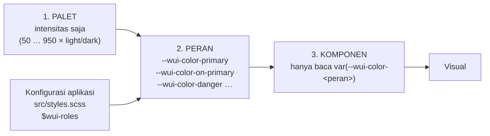

# Planning — Pemisahan Palet & Peran Warna (Role Layer) `@wajek/wui`

> Tujuan: memisahkan **palet** (data warna berdasarkan tingkat intensitas) dari **peran semantik**
> (`primary`, `on-primary`, `secondary`, `on-secondary`, `danger`, `on-danger`, `surface`,
> `on-surface`, `surface-container`, …). Palet tidak lagi menyimpan kunci peran, dan peran bisa
> diarahkan ke palet mana pun — atau diberi warna langsung — dari `src/styles.scss` aplikasi.

Status: **✅ dieksekusi (17 Sep 2026)** — C1–C4 selesai; lint + 2 build hijau; token ter-emit
dibandingkan sebelum/sesudah (nilai lama identik) dan diperiksa di browser pada mode terang & gelap.
**Revisi 2 (17 Sep 2026):** palet **`neutral`** ditambahkan dan peran `surface`/`on-surface`/`outline`
diarahkan ke tone palet itu (sebelumnya nilai mentah). Nilai ter-emit **tidak berubah** — dibuktikan
dengan diff 86 token warna. Variabel `$wui-light/dark-*` dihapus karena sudah digantikan palet.
Motif: user memutuskan `'on-primary'` **keluar** dari data palet supaya palet tetap murni
"intensitas", dan peran warna dideklarasikan terpisah agar bisa dikonfigurasi dari root project.
Dokumen terkait: `docs/planning/scss-color-palette-plan.md` (F0–F3 selesai; dokumen itu mencatat
keputusan lama C5/C17/C19 — akan ditandai sebagai revisi), `docs/planning/wui-button-color-plan.md`
(belum ada — varian warna tombol `default|primary|danger` menunggu refaktor ini), `wui-button-icon-plan.md`.

---

## 0. Lingkup

| Masuk lingkup | Di luar lingkup (dicatat untuk nanti) |
| --- | --- |
| Palet murni tone (`on-*` keluar dari data palet) | Runtime palette switching (`data-palette`) — sudah ditunda di C10 |
| Lapisan **peran** baru + token `--wui-color-<peran>` | Penambahan palet lengkap untuk `secondary`/`neutral` (butuh angka Figma) |
| Rename `text` → `on-surface`, `background` → `surface` | `outline-variant`, `surface-dim/bright`, `scrim`, elevation tint |
| Konfigurasi peran dari `src/styles.scss` (map per mode) | Generator tone dari satu warna (dibatalkan di C14) |
| State layer diturunkan dari daftar peran (bukan hardcoded `primary`) | Varian warna tombol (`color="danger"`) — plan terpisah, setelah ini |
| Verifikasi: **tampilan demo tidak berubah** (nilai default sama) | Mode gelap manual (class/atribut) — sekarang murni `prefers-color-scheme` |

---

## 1. Kondisi sekarang

**Palet** (`abstracts/_tokens.scss`): tiap palet menyimpan tone `50…950` **plus** kunci peran
`'on-primary'` di dalam `'light'`/`'dark'`. `themes/_palette.scss` lalu:
`palette-scale()` menyaring kunci non-numerik agar tidak jadi token skala, dan `palette()` meng-emit
`--wui-color-primary` + `--wui-color-on-primary` + state layer.

**Peran yang ada sekarang** — sebagian lahir di palet, sebagian di tema:

| Token | Didefinisikan di | Nilai |
| --- | --- | --- |
| `--wui-color-primary` | `themes/_palette.scss` | `var(--wui-color-purple-500)` (mode-aware) |
| `--wui-color-on-primary` | `themes/_palette.scss` | kunci `'on-primary'` palet, per mode |
| `--wui-color-background` | `themes/_light-theme.scss` + `_dark-theme.scss` | `$wui-light/dark-background` |
| `--wui-color-text` | `themes/_light-theme.scss` + `_dark-theme.scss` | `$wui-light/dark-text` |
| `--wui-color-outline` | `themes/_light-theme.scss` + `_dark-theme.scss` | `$wui-light/dark-outline` |
| `--wui-color-disabled-container/content` | `themes/_light-theme.scss` | `color-mix(on-surface 12%/38%)` |
| `--wui-color-state-layer-<peran>-opacity-08/10/16` | `themes/_palette.scss` | peran dari `$wui-state-layer-roles` = `('primary','on-primary')` |

**Pemakai token** (hasil inventaris `grep`):

| Berkas | Membaca |
| --- | --- |
| `base/_typography.scss` | `background` (body), `text` (body) |
| `components/_button.scss` | `primary`, `on-primary`, `outline`, `disabled-*` |
| `components/_page.scss` | `background` |
| `components/_sidenav.scss` | `background`, `outline`, `text` |
| `components/_topbar.scss` | `outline` |
| `components/_icon.scss` | hanya komentar |
| `src/app/pages/button/**`, `tipografi.page/**` (demo) | `primary`, `text` |

**Masalah yang mau diselesaikan**

1. Palet mencampur dua tanggung jawab: intensitas **dan** peran (`on-primary`).
2. Peran lain tidak punya tempat yang jelas — ada yang di palet, ada yang di `_light-theme.scss`.
3. Menambah peran (`danger`, `secondary`, `surface-container`) atau menggantinya dari sisi aplikasi
   tidak punya satu pintu konfigurasi.
4. `$wui-state-layer-roles` hardcoded `('primary','on-primary')` → peran baru tidak otomatis dapat
   state layer.

---

## 2. Arsitektur target — tiga lapis



- **Lapis 1 (palet)** = `abstrak/_tokens.scss` → `$wui-palettes-builtin` + `$wui-palettes-extra`.
  Isinya **hanya** `('light': (50: …, 500: …), 'dark': (…))`. Tidak ada kunci peran.
- **Lapis 2 (peran)** = berkas baru `themes/_roles.scss` → memetakan peran ke palet+tone atau warna
  langsung, per mode, dan menurunkan state layer untuk peran yang interaktif.
- **Lapis 3 (komponen)** = tidak berubah prinsipnya: tetap hanya membaca token peran (tidak pernah
  tahu nama palet).

---

## 3. API konfigurasi (dari `src/styles.scss` aplikasi)

```scss
@use '@wajek/wui/scss/wui.scss' with (
  // 1. Palet: cukup kalau aplikasi mau memakai palet bawaan.
  $wui-palette: 'purple',

  // 2. Tambah/ubah palet (murni tone, tanpa kunci peran).
  $wui-palettes-extra: (
    'brand': (
      'light': (50: #eef, 500: #320095, 900: #05000f),
      'dark':  (50: #252, 500: #d9d0ff, 900: #fff),
    ),
  ),

  // 3. Peran: satu pintu untuk semua warna semantik.
  $wui-roles: (
    'light': (
      'primary':             ('brand', 500),   // ← dari palet
      'on-primary':          #fff,             // ← warna langsung
      'secondary':           ('brand', 300),
      'on-secondary':        #1a1a1a,
      'danger':              ('red', 500),
      'on-danger':           #fff,
      'surface':             #fdf8ff,
      'on-surface':          #1a1a1a,
      'surface-container':   #f2ecf8,
      'on-surface-container': #1a1a1a,
      'outline':             #cac4d5,
    ),
    'dark': ( /* bentuk sama; kalau tidak diisi → memakai nilai 'light' */ ),
  ),
);
```

**Aturan nilai sebuah peran:**

| Bentuk nilai | Arti | Contoh |
| --- | --- | --- |
| `(palet, tone)` | Ambil warna dari data palet pada mode yang sedang di-emit → hasilnya **hex** (compile-time) | `('brand', 500)` |
| warna (`#rrggbb`, `rgb(…)`) | Dipakai apa adanya | `#fff` |
| `false` | Peran **tidak** di-emit (sentinel, sama seperti `$wui-palette: false`) — `null` tidak dipakai karena flag `!default` menganggapnya "belum diisi" | `'outline': false` |

Catatan penting: nilai `('palet', tone)` **diselesaikan jadi hex saat compile**, jadi token peran
tidak lagi bergantung pada token skala palet. Skala palet tetap di-emit terpisah untuk dipakai
langsung (utilitas, eksperimen, `--wui-color-<palet>-<tone>`).

---

## 4. Peran default (nilai bawaan library) — tampilan tidak berubah

Nilai bawaan sengaja **menyalin nilai yang berlaku sekarang**, supaya refaktor ini netral secara visual:

| Peran | Light default | Dark default | Sumber |
| --- | --- | --- | --- |
| `primary` | `purple.500` = `#320095` | `purple.500` (dark) = `#d9d0ff` | palet `purple` |
| `on-primary` | `#fff` | `#05000f` | nilai lama `'on-primary'` di data palet |
| `surface` | `neutral.50` = `#FDF8FF` | `neutral.950` = `#14121A` | palet `neutral` (revisi 2) |
| `on-surface` | `neutral.900` = `#1a1a1a` | `neutral.50` = `#f5f5f5` | palet `neutral` (revisi 2) |
| `outline` | `neutral.400` = `#CAC4D5` | `neutral.700` = `#484553` | palet `neutral` (revisi 2) |
| `surface-container` | `color-mix(on-surface 5%, surface)` | `color-mix(on-surface 8%, surface)` | **diturunkan** (tidak ada hex baru) |
| `on-surface-container` | `= on-surface` | `= on-surface` | turunan |
| `danger` | `red.500` = `#b3261e` | `red.500` (dark) = `#f2b8b5` | palet `red` (placeholder) |
| `on-danger` | `red.50` = `#fff5f4` | `red.950` = `#601410` | palet `red` (placeholder) |
| `secondary` | `magenta.500` = `#a61e9e` | `magenta.500` (dark) = `#f5b0ec` | palet `magenta` (placeholder) |
| `on-secondary` | `magenta.50` = `#fff5fc` | `magenta.950` = `#5a1e56` | palet `magenta` (placeholder) |

> ⚠️ Palet `red` dan `magenta` **placeholder** — dibuat supaya varian warna tombol bisa dikerjakan
> sekarang, dan akan diganti setelah desainer menetapkan nilainya. Mengganti cukup menimpa tone di
> `$wui-palettes-builtin` (atau lewat `$wui-palettes-extra`) tanpa menyentuh berkas lain.
> Palet `neutral` menjadi acuan semua peran netral, jadi mengganti `surface`/`outline` cukup mengubah
> tone di palet itu (atau memetakan ulang di `$wui-roles`).

`--wui-color-disabled-container/content` tetap sama rumusnya (12% / 38%) tetapi **sumbernya
`on-surface`**, bukan `text`.

**State layer** — `$wui-state-layer-roles` tidak lagi hardcoded:
`('primary','on-primary','secondary','on-secondary','danger','on-danger')`, dan refaktor ini
memvalidasi: setiap peran di daftar itu **wajib ada** di `$wui-roles`, kalau tidak → `@error`
(sekarang kesalahan seperti ini lewat begitu saja).

---

## 5. Rancangan teknis per berkas

| Berkas | Perubahan |
| --- | --- |
| `abstracts/_tokens.scss` | Hapus kunci `'on-primary'` dari `$wui-palettes-builtin`; tambah palet `red`, `magenta`, dan `neutral`; **hapus** variabel warna mentah (`$wui-light/dark-*`) karena nilainya kini tone palet `neutral` |
| `themes/_roles.scss` | **baru** — `$wui-roles` (map per mode), fungsi `role-value()` (resolusi palet→hex + validasi tone), mixin `roles()` (emit `:root` + blok `@media (prefers-color-scheme: dark)`), mixin `state-layers()` dipindah ke sini dan di-loop dari peran |
| `themes/_palette.scss` | Menyusut jadi **skala saja**: `palette()` meng-emit tone (tidak lagi `--wui-color-primary`/`on-primary`/state layer); `palette-scale()` tetap menyaring kunci non-numerik (tahan banting kalau konsumen lama masih menaruh `on-*`); `$wui-palette-reserved` ditambah nama peran baru |
| `themes/_light-theme.scss` | Buang 3 baris warna (`background`/`text`/`outline`) → pindah ke roles; sisanya tetap (spasi, radius, z-index, motion, overlay, disabled, elevasi, tipografi, sidenav) |
| `themes/_dark-theme.scss` | Tinggal `color-scheme: dark` (warna gelap di-emit `roles()`) |
| `wui.scss` | `@include themes.roles;` setelah `light-theme` (dan sebelum komponen); `@include themes.palette(…)` tetap untuk skala |
| `base/_typography.scss` | `background` → `surface`, `text` → `on-surface` |
| `components/_page.scss`, `_sidenav.scss`, `_topbar.scss` | Rename token yang sama |
| `components/_button.scss` | Rename `text`→`on-surface` pada disabled? tidak — disabled sudah pakai `disabled-*`; tidak ada perubahan selain komentar |
| `src/styles.scss` (demo) | Contoh konfigurasi peran (opsional: tunjukkan `danger` dari `('purple', 900)`) |
| `src/app/pages/**/*.scss` (demo) | Rename `--wui-color-text` → `--wui-color-on-surface` |
| `projects/wui/README.md` | Tabel token warna baru + contoh `with ($wui-roles: …)` |
| `docs/planning/scss-color-palette-plan.md` | Catatan revisi: C5/C17 digantikan dokumen ini |

---

## 6. Breaking change & migrasi

| Perubahan | Dampak | Catatan |
| --- | --- | --- |
| `--wui-color-background` → `--wui-color-surface` | Aplikasi yang menulis token ini harus rename | Library belum dipublikasikan/dikonsumsi dari registry (lihat catatan Fase 5 di `scss-wui-plan.md`) → rename bersih, **tanpa alias** |
| `--wui-color-text` → `--wui-color-on-surface` | idem | idem |
| Kunci `'on-primary'` di data palet | Palet aplikasi yang masih memuat kunci ini tidak error (disaring), tapi nilainya **diabaikan** → wajib pindah ke `$wui-roles` | Diberi peringatan di README + komentar token |
| `$wui-palette` | Semantik menyempit: hanya "palet yang skalanya di-emit" | Tidak lagi menentukan warna primary |
| `themes.palette($name, $tones, $activate)` | Parameter `$activate` hilang | Fungsi internal; `all-palettes` tetap |

---

## 7. Fase kerja

| Fase | Isi | Keluaran | Status |
| --- | --- | --- | --- |
| **C1** | `themes/_roles.scss` (data + `role-value()` + `roles()` + `derived-roles()` + `state-layers()`), palet dibersihkan dari `on-*`, palet `red` + `magenta` ditambahkan | Token peran ter-emit; nilai lama identik (dibuktikan lewat diff) | ✅ |
| **C2** | Rename konsumen (`surface`, `on-surface`) di `base/` + `components/` + demo | `grep` sisa nama lama → bersih | ✅ |
| **C3** | `_light-theme.scss`/`_dark-theme.scss` dirapikan, `$wui-state-layer-roles` + validasi peran | Satu pintu untuk semua warna | ✅ |
| **C4** | Konfigurasi contoh di `src/styles.scss` + README + catatan di dokumen lama | Panduan konsumen | ✅ |

**Catatan hasil**

- Diff token warna (`www/styles.css` sebelum vs sesudah) bersih dari perubahan nilai: `surface` =
  `#FDF8FF`/`#14121A`, `on-surface` = `#1a1a1a`/`#f5f5f5`, `outline` = `#CAC4D5`/`#484553` — sama persis
  dengan `background`/`text`/`outline` sebelumnya.
- Satu perubahan representasi yang disengaja: `--wui-color-primary` kini **hex hasil kompilasi**
  (`#320095`/`#d9d0ff`), bukan lagi `var(--wui-color-purple-500)`. Nilainya sama, tapi peran tidak lagi
  ikut berubah kalau token skala ditimpa saat runtime (konsekuensi desain: peran diselesaikan compile-time).
- Peran baru terverifikasi di browser (light & dark): `secondary` `#a61e9e`/`#f5b0ec`,
  `danger` `#b3261e`/`#f2b8b5`, `on-danger` `#fff5f4`/`#601410`, dan
  `surface-container` = `color-mix(on-surface 5%, surface)` di terang, `8%` di gelap.
- Temuan lint di luar rencana: `components/_topbar.scss` melanggar
  `declaration-empty-line-before` (deklarasi tepat di bawah `@include`) → baris kosong ditambahkan,
  tanpa perubahan perilaku.

---

## 8. Verifikasi

```sh
docker exec -w /workspace wui_angular_dev sh -c "npm run lint:styles"
docker exec -w /workspace wui_angular_dev sh -c "npx ng build wui && npx ng build --configuration development"
# nilai token peran sesudah refaktor (harus sama dengan sebelum, kecuali nama baru)
docker exec -w /workspace wui_angular_dev sh -c "grep -o -- '--wui-color-[a-z-]*: [^;]*' www/styles.css | sort -u"
# memastikan tidak ada sisa nama lama
docker exec -w /workspace wui_angular_dev sh -c "grep -rn -e '--wui-color-text' -e '--wui-color-background' projects/wui src || echo BERSIH"
```

| Cek | Ekspektasi |
| --- | --- |
| Visual demo | **Tidak berubah** — light: `#320095` primary, `#FDF8FF` surface, `#1a1a1a` on-surface, `#CAC4D5` outline; dark: `#d9d0ff`, `#14121A`, `#f5f5f5`, `#484553` |
| Token peran | `primary`, `on-primary`, `secondary`, `on-secondary`, `danger`, `on-danger`, `surface`, `on-surface`, `surface-container`, `on-surface-container`, `outline` ter-emit di kedua mode |
| State layer | 6 peran × 3 opacity ter-emit; peran yang tidak ada di `$wui-roles` → **build gagal** dengan pesan jelas |
| Peran dari palet | Mengubah `$wui-roles` di `src/styles.scss` mengubah `--wui-color-primary` tanpa menyentuh berkas library |
| `false` pada peran | Peran tidak di-emit, dan **build tidak gagal** kalau peran itu bukan bagian daftar state layer |
| Sisa nama lama | `grep` terakhir → `BERSIH` |

---

## 9. Risiko & jebakan

| Risiko | Mitigasi |
| --- | --- |
| `@forward` order | `themes/_index.scss` harus `@forward 'roles';` **sebelum** modul lain yang `@use`-nya, dan `$wui-roles` harus berada di modul yang di-forward `wui.scss` (pola kegagalan "This module was already loaded" sudah pernah kena di `abstracts/_index.scss`) |
| `null` sebagai "matikan" | Pakai `false` (gotcha `!default` yang sudah terbukti) |
| Peran dari palet → tone tidak ada | `role-value()` memberi `@error` yang menyebut palet + tone + daftar tone yang tersedia |
| `color-mix` untuk `surface-container` | Diturunkan dari `on-surface` + `surface`, jadi satu definisi untuk dua mode; bila nanti Figma punya angka pasti, cukup ganti jadi hex di map |
| Warna disabled | Tetap `color-mix(on-surface 12%/38%)`; satu definisi, otomatis ikut palet mana pun |
| Dua blok `prefers-color-scheme` (roles & palette) | Aman (token berbeda), tapi urutan `@include` dijaga: `light-theme` → `roles` → `palette` |

---

## 10. Keputusan — **sudah dijawab** (17 Sep 2026)

| # | Keputusan | Hasil |
| --- | --- | --- |
| 1 | Bentuk konfigurasi | ✅ Satu map `$wui-roles` per mode (bukan variabel per peran) |
| 2 | Rename `background`→`surface`, `text`→`on-surface` tanpa alias | ✅ Dipakai |
| 3 | `secondary` | ✅ Palet **`magenta`** baru dibuat, dipakai sebagai default `secondary`/`on-secondary` |
| 4 | `surface-container` | ✅ Diturunkan `color-mix(on-surface 5%/8%, surface)` |
| 5 | `danger`/`on-danger` | ✅ Diambil dari palet **`red`** baru (`red.500`, `red.50`/`red.950`) — keduanya placeholder sampai desainer selesai |
| 6 | Lanjut varian warna tombol `color="default\|primary\|danger"` | ✅ Berikutnya, sebagai plan terpisah |

**Pekerjaan berikutnya:** `docs/planning/wui-button-color-plan.md` — varian warna tombol
(`default`/`primary`/`danger`) yang memakai peran-peran di dokumen ini, plus keputusan apakah
`default` berarti netral (`surface-container`/`on-surface`) atau tetap primary.
